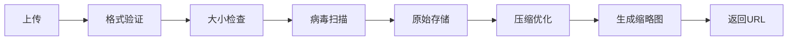

# ADR-0004: 文件存储策略 - 本地存储 + CDN接口

## Status
Accepted (2026-05-08)

## Context
系统需要支持用户上传图片，涉及以下需求：
- 文章中插入图片
- 图片库管理（查看、删除、替换）
- 支持常见图片格式（JPG、PNG、GIF、WebP）
- 图片压缩和优化
- 存储成本控制

## Decision
采用**本地文件存储**作为初期方案，同时**预留CDN集成接口**以便未来扩展。

## Architecture

### 存储架构
```
┌─────────────┐
│   前端应用   │
└──────┬──────┘
       │ 上传图片
       ↓
┌─────────────┐
│  API Gateway│
└──────┬──────┘
       │
       ↓
┌─────────────────────┐
│   图片上传服务       │
│  - 格式验证          │
│  - 大小限制          │
│  - 压缩优化          │
└──────┬──────────────┘
       │
       ↓
┌─────────────────────┐
│  本地文件存储         │
│  /uploads/images/    │
└─────────────────────┘
       │
       ↓ (可选，后期)
┌─────────────────────┐
│     CDN服务          │
│  (Cloudflare/AWS)   │
└─────────────────────┘
```

### 实现要点

#### 1. 目录结构
```
project_root/
├── uploads/
│   ├── images/
│   │   ├── original/    # 原始文件
│   │   ├── compressed/   # 压缩后
│   │   └── thumbnails/   # 缩略图
│   └── temp/            # 临时上传
```

#### 2. 文件命名策略
```
{user_id}_{timestamp}_{random_string}.{ext}
例：42_1652345678_a1b2c3d4.jpg
```

#### 3. API设计
```typescript
// 上传图片
POST /api/v1/images/upload
Request: multipart/form-data
Response: {
  id: "uuid",
  url: "https://cdn.example.com/images/xxx.jpg",
  filename: "xxx.jpg",
  size: 102400,
  mimeType: "image/jpeg"
}

// 获取图片列表
GET /api/v1/images?article_id=xxx

// 删除图片
DELETE /api/v1/images/:id
```

## Image Processing Pipeline

### 处理流程


### 优化策略

#### 格式转换
- 接受：JPG、PNG、GIF、WebP
- 存储：统一转换为WebP（节省空间）
- 例外：保留GIF动图

#### 压缩规则
```javascript
{
  maxWidth: 1920,           // 最大宽度
  maxHeight: 1080,          // 最大高度
  quality: 85,              // JPEG质量
  progressive: true,        // 渐进式JPEG
  stripMetadata: true       // 移除EXIF
}
```

#### 缩略图生成
```
- 小缩略图: 200x200 (头像、列表)
- 中缩略图: 800x600 (编辑器预览)
- 大缩略图: 1280x720 (文章配图)
```

### 技术实现

#### 图片处理库选择（待定）
- **Sharp** (推荐): 高性能、支持WebP
- **Jimp**: 纯JS、速度较慢
- **ImageMagick**: 功能强大但重量级

#### 伪代码示例
```typescript
import sharp from 'sharp';

async processImage(buffer: Buffer): Promise<ProcessedImages> {
  // 原始图
  const original = await sharp(buffer)
    .metadata();

  // 压缩图
  const compressed = await sharp(buffer)
    .resize(1920, 1080, { fit: 'inside' })
    .webp({ quality: 85 })
    .toBuffer();

  // 缩略图
  const thumbnail = await sharp(buffer)
    .resize(200, 200, { fit: 'cover' })
    .webp({ quality: 80 })
    .toBuffer();

  return { original, compressed, thumbnail };
}
```

## Storage Limits & Policies

### 限制策略
| 限制项 | 限制值 | 理由 |
|--------|--------|------|
| 单文件大小 | 5MB | 平衡用户体验和存储成本 |
| 文件格式 | JPG/PNG/GIF/WebP | 覆盖主流格式 |
| 用户总配额 | 2GB | 个人博客足够 |
| 图片尺寸 | 10000x10000 | 防止处理超时 |

### 清理策略
- **临时文件**: 上传失败后1小时删除
- **未关联图片**: 每周清理未关联到任何文章的图片
- **已删除文章图片**: 保留30天后删除（软删除）

## CDN Integration (Future)

### 接口设计
```typescript
// Storage Provider Interface
interface StorageProvider {
  upload(file: Buffer, path: string): Promise<string>;
  delete(path: string): Promise<void>;
  getUrl(path: string): string;
}

// Local Storage Implementation
class LocalStorageProvider implements StorageProvider {
  // 实现本地存储逻辑
}

// CDN Implementation (Future)
class CDNStorageProvider implements StorageProvider {
  // 实现CDN存储逻辑
}
```

### CDN候选方案
1. **Cloudflare Images**: 自动优化、全球分发
2. **AWS CloudFront + S3**: 成熟稳定
3. **Upstash Blob Storage**: 边缘存储、低延迟
4. **Supabase Storage**: 开源、免费额度

### 迁移策略
1. 实现StorageProvider接口
2. 逐步迁移存量图片到CDN
3. 更新数据库中的URL引用
4. 切换流量到CDN

## Security Considerations

### 安全措施
1. **文件类型验证**
   - Magic Number检测（不依赖扩展名）
   - MIME类型白名单

2. **病毒扫描**
   - ClamAV集成
   - 隔离可疑文件

3. **访问控制**
   - 私有图片需要认证
   - 签名URL防止盗链

4. **路径遍历防护**
   - 禁止文件名中的特殊字符
   - 验证路径在允许目录内

### 伪代码安全检查
```typescript
function validateFilename(filename: string): boolean {
  // 禁止路径遍历
  if (filename.includes('..') || filename.includes('/')) {
    return false;
  }

  // 白名单扩展名
  const allowedExt = ['.jpg', '.jpeg', '.png', '.gif', '.webp'];
  const ext = path.extname(filename).toLowerCase();
  return allowedExt.includes(ext);
}
```

## Consequences

### 正面影响
1. **零额外成本**: 本地存储无费用
2. **实现简单**: 无需第三方集成
3. **部署简单**: Docker Volume持久化
4. **数据主权**: 完全控制数据

### 负面影响
1. **无CDN加速**: 加载速度较慢
2. **扩展性限制**: 单服务器存储上限
3. **备份责任**: 需要自己备份数据
4. **带宽成本**: 高流量时带宽费用高

### 缓解策略
- 短期：Nginx缓存、浏览器缓存
- 长期：预留CDN接口，按需迁移

## Alternatives Considered

### 选项A：直接使用云存储（AWS S3）
**优点**：无限扩展、内置CDN
**缺点**：持续成本、复杂度高
**不选原因**：初期流量小，成本不划算

### 选项B：对象存储自托管（MinIO）
**优点**：S3兼容、可自托管
**缺点**：运维复杂度增加
**不选原因**：简单场景下本地存储足够

## Cost Analysis

### 本地存储成本（月度）
- 存储：$0 (包含在服务器成本)
- 带宽：$0-10 (随流量增加)
- **总计**: $0-10/月

### CDN存储成本（月度，估算）
- 存储：$0.023/GB (AWS S3)
- 请求：$0.0004/1000次
- 流量：$0.085/GB (CloudFront)
- **估算**：100GB存储 + 100万请求 + 1TB流量 ≈ $95/月

**结论**: 初期使用本地存储，流量增长后再切换CDN。

## References
- Sharp Documentation
- Image Optimization Best Practices
- WebP Compression Guide

---

**Created**: 2026-05-08
**Author**: HF Design Workflow
