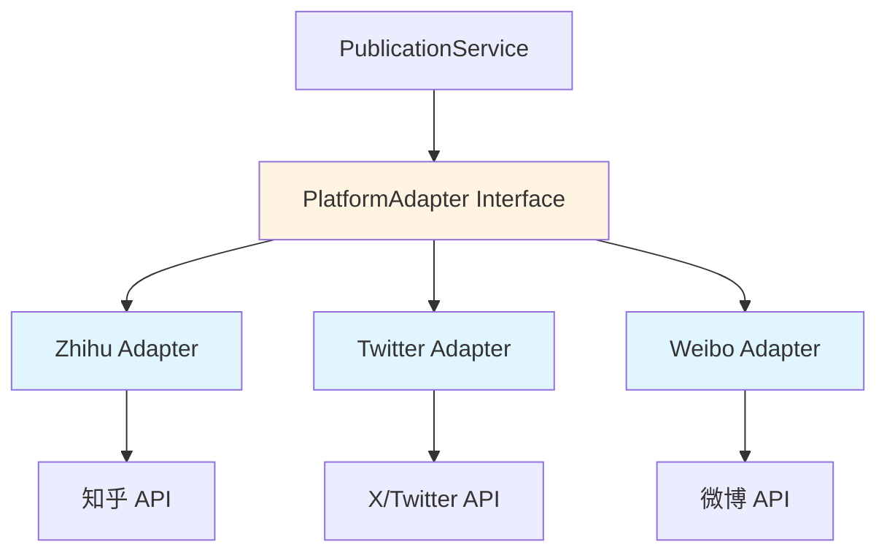

# ADR-0005: 多平台适配器模式

## Status
Accepted (2026-05-08)

## Context
系统需要支持将文章转发到多个内容平台：
- 知乎（文章平台）
- X/Twitter（微博平台）
- 微博（可选）

各平台的API存在以下差异：
- **数据格式**: 字段名称、内容长度限制、支持的功能
- **认证方式**: OAuth 1.0 vs OAuth 2.0 vs API Key
- **API限制**: 调用频率、发布次数限制
- **错误处理**: 错误码、错误消息格式
- **功能特性**: 有的支持Markdown，有的只支持HTML

## Decision
采用**适配器模式（Adapter Pattern）**封装各平台API差异，提供统一的发布接口。

## Architecture

### 适配器模式结构



### 核心接口设计

```typescript
// 适配器接口
interface PlatformAdapter {
  // 平台元信息
  readonly platformId: string;
  readonly platformName: string;
  readonly supportedFormats: ContentFormat[];

  // OAuth授权
  getAuthorizationUrl(): Promise<string>;
  handleCallback(code: string): Promise<Credentials>;

  // 内容发布
  publish(content: PublicationContent): Promise<PublicationResult>;

  // 内容格式转换
  transformContent(article: Article): PlatformContent;

  // 健康检查
  validateCredentials(credentials: Credentials): Promise<boolean>;
}

// 数据类型
interface PublicationContent {
  title: string;
  content: string;      // Markdown格式
  tags: string[];
  images: ImageUrl[];
  categories: string[];
}

interface PlatformContent {
  // 平台特定格式
  raw: any;
  metadata: Record<string, any>;
}

interface PublicationResult {
  success: boolean;
  platformPostId?: string;
  platformUrl?: string;
  error?: string;
  retryable?: boolean;
}
```

## Implementation Details

### 1. 基础适配器抽象类

```typescript
abstract class BaseAdapter implements PlatformAdapter {
  abstract readonly platformId: string;
  abstract readonly platformName: string;
  abstract readonly supportedFormats: ContentFormat[];

  protected httpService: HttpService;
  protected rateLimiter: RateLimiter;

  constructor(
    protected config: PlatformConfig,
    protected credentialsRepo: CredentialsRepository
  ) {
    this.httpService = new HttpService(config.baseUrl);
    this.rateLimiter = new RateLimiter(config.rateLimits);
  }

  // 模板方法
  async publish(content: PublicationContent): Promise<PublicationResult> {
    try {
      // 1. 检查凭证
      const credentials = await this.getCredentials();
      if (!credentials || !await this.validateCredentials(credentials)) {
        return { success: false, error: 'Invalid credentials', retryable: false };
      }

      // 2. 转换内容
      const platformContent = this.transformContent(content);

      // 3. 上传图片
      const images = await this.uploadImages(content.images);

      // 4. 发布内容
      await this.rateLimiter.throttle();
      const result = await this.doPublish(platformContent, images, credentials);

      return {
        success: true,
        platformPostId: result.postId,
        platformUrl: result.url
      };
    } catch (error) {
      return this.handleError(error);
    }
  }

  // 子类实现
  protected abstract doPublish(
    content: PlatformContent,
    images: string[],
    credentials: Credentials
  ): Promise<{ postId: string; url: string }>;

  protected abstract transformContent(article: Article): PlatformContent;

  protected abstract handleError(error: any): PublicationResult;
}
```

### 2. 知乎适配器示例

```typescript
class ZhihuAdapter extends BaseAdapter {
  readonly platformId = 'zhihu';
  readonly platformName = '知乎';
  readonly supportedFormats = [ContentFormat.Markdown];

  protected async doPublish(
    content: PlatformContent,
    images: string[],
    credentials: Credentials
  ): Promise<{ postId: string; url: string }> {
    // 知乎API调用
    const response = await this.httpService.post('/api/v3/articles', {
      title: content.raw.title,
      content: content.raw.content,
      images: images
    }, {
      headers: { 'Authorization': `Bearer ${credentials.accessToken}` }
    });

    return {
      postId: response.data.id,
      url: `https://zhuanlan.zhihu.com/p/${response.data.id}`
    };
  }

  protected transformContent(article: Article): PlatformContent {
    // Markdown → 知乎格式
    const content = article.content
      .replace(/!\[([^\]]*)\]\(([^)]+)\)/g, (match, alt, url) => {
        // 知乎图片语法
        return ``;
      });

    return {
      raw: {
        title: article.title.substring(0, 100), // 知乎标题限制
        content: content,
        summary: article.summary || article.content.substring(0, 200)
      },
      metadata: {
        column: this.config.defaultColumn // 默认专栏
      }
    };
  }

  protected handleError(error: any): PublicationResult {
    if (error.response?.status === 429) {
      return { success: false, error: 'Rate limit exceeded', retryable: true };
    }
    return {
      success: false,
      error: error.response?.data?.error || 'Unknown error',
      retryable: false
    };
  }
}
```

### 3. X/Twitter适配器示例

```typescript
class TwitterAdapter extends BaseAdapter {
  readonly platformId = 'twitter';
  readonly platformName = 'X/Twitter';
  readonly supportedFormats = [ContentFormat.PlainText];

  protected async doPublish(
    content: PlatformContent,
    images: string[],
    credentials: Credentials
  ): Promise<{ postId: string; url: string }> {
    // Twitter API v2 调用
    const mediaIds = await this.uploadMedia(images, credentials);

    const response = await this.httpService.post('/2/tweets', {
      text: content.raw.text,
      media: mediaIds.length > 0 ? { media_ids: mediaIds } : undefined
    }, {
      headers: { 'Authorization': `Bearer ${credentials.accessToken}` }
    });

    return {
      postId: response.data.data.id,
      url: `https://twitter.com/i/status/${response.data.data.id}`
    };
  }

  protected transformContent(article: Article): PlatformContent {
    // Markdown → 纯文本（Twitter不支持Markdown）
    const text = article.content
      .replace(/[*_#`]/g, '') // 移除Markdown语法
      .replace(/\[([^\]]+)\]\([^)]+\)/g, '$1') // 移除链接，保留文本
      .substring(0, 280); // Twitter字符限制

    return {
      raw: {
        text: `${article.title}\n\n${text}\n\n${article.url}` // 添加原文链接
      },
      metadata: {}
    };
  }

  private async uploadMedia(
    images: string[],
    credentials: Credentials
  ): Promise<string[]> {
    // Twitter媒体上传逻辑
    const mediaIds: string[] = [];

    for (const imageUrl of images.slice(0, 4)) { // Twitter最多4张图
      const response = await this.httpService.post('/1.1/media/upload.json',
        this.readImageAsStream(imageUrl),
        { headers: { 'Authorization': `Bearer ${credentials.accessToken}` } }
      );
      mediaIds.push(response.data.media_id_string);
    }

    return mediaIds;
  }
}
```

## Content Transformation Strategy

### 转换管道


### 转换规则

| 平台 | 标题限制 | 内容限制 | 图片支持 | 标签支持 | 格式偏好 |
|------|---------|---------|---------|---------|---------|
| 知乎 | 100字 | 无限制 | ✅ | ✅ | Markdown |
| X/Twitter | - | 280字符 | ✅ (4张) | ✅ (Hashtag) | 纯文本 |
| 微博 | - | 2000字符 | ✅ (9张) | ✅ (话题) | HTML/纯文本 |

### 图片处理策略

```typescript
interface ImageUploadStrategy {
  upload(imageUrl: string): Promise<string>;  // 返回平台图片URL
  reorder(images: string[]): Promise<string[]>; // 调整顺序
  compress(image: Buffer): Promise<Buffer>;   // 压缩
}
```

## Rate Limiting

### 限流策略

```typescript
class RateLimiter {
  private limits: Map<string, RateLimitConfig>;

  async throttle(platformId: string): Promise<void> {
    const config = this.limits.get(platformId);

    if (config.type === 'sliding-window') {
      await this.slidingWindowLimit(config);
    } else if (config.type === 'token-bucket') {
      await this.tokenBucketLimit(config);
    }
  }

  private async slidingWindowLimit(config: SlidingWindowConfig): Promise<void> {
    // 滑动窗口限流实现
    const now = Date.now();
    const requests = await this.getRecentRequests(config.windowSize);

    if (requests.length >= config.maxRequests) {
      const waitTime = requests[0].timestamp + config.windowSize - now;
      await this.sleep(waitTime);
    }
  }
}

// 各平台限流配置
const RATE_LIMITS = {
  zhihu: { type: 'sliding-window', maxRequests: 100, windowSize: 3600000 },
  twitter: { type: 'token-bucket', rate: 50, windowSize: 3600000 },
  weibo: { type: 'sliding-window', maxRequests: 100, windowSize: 3600000 }
};
```

## Error Handling & Retry

### 重试策略

```typescript
class RetryPolicy {
  async execute<T>(
    fn: () => Promise<T>,
    context: PublicationContext
  ): Promise<T> {
    let lastError: Error;

    for (let attempt = 0; attempt < this.maxAttempts; attempt++) {
      try {
        return await fn();
      } catch (error) {
        lastError = error;

        if (!this.isRetryable(error)) {
          throw error;
        }

        const delay = this.calculateBackoff(attempt);
        await this.sleep(delay);
      }
    }

    throw lastError;
  }

  private isRetryable(error: any): boolean {
    // 可重试的错误类型
    return (
      error.code === 'ECONNRESET' ||
      error.response?.status === 429 || // Rate limit
      error.response?.status === 503 || // Service unavailable
      error.response?.status >= 500     // Server errors
    );
  }

  private calculateBackoff(attempt: number): number {
    // 指数退避: 1s, 2s, 4s, 8s
    return Math.min(1000 * Math.pow(2, attempt), 8000);
  }
}
```

## Testing Strategy

### 单元测试
```typescript
describe('ZhihuAdapter', () => {
  it('should transform Markdown to Zhihu format', () => {
    const adapter = new ZhihuAdapter(config, repo);
    const article = createMockArticle();
    const result = adapter.transformContent(article);

    expect(result.raw.title).toHaveLength.lessThanOrEqual(100);
    expect(result.raw.content).toBeDefined();
  });

  it('should handle rate limit errors', async () => {
    // Mock 429 response
    const result = await adapter.publish(content);
    expect(result.success).toBe(false);
    expect(result.retryable).toBe(true);
  });
});
```

### 集成测试
```typescript
describe('Publication Integration', () => {
  it('should publish to Zhihu successfully', async () => {
    // 使用测试账号
    const result = await publicationService.publishToPlatform(
      article,
      'zhihu'
    );

    expect(result.success).toBe(true);
    expect(result.platformUrl).toMatch(/zhuanlan.zhihu.com/);
  });
});
```

## Consequences

### 正面影响
1. **统一接口**: 新增平台只需实现适配器接口
2. **隔离变化**: 平台API变更不影响其他平台
3. **可测试性**: 每个适配器可独立测试
4. **灵活配置**: 可按需启用/禁用平台

### 负面影响
1. **实现成本**: 每个平台需要单独开发适配器
2. **维护负担**: 平台API变更需要更新适配器
3. **功能限制**: 统一接口可能无法覆盖所有平台特性

### 缓解策略
- 优先实现高频平台（知乎、X）
- 其他平台按需开发
- 提供详细的适配器开发文档

## Extension Points

### 添加新平台

1. 实现适配器接口
```typescript
class NewPlatformAdapter extends BaseAdapter {
  readonly platformId = 'new-platform';
  readonly platformName = 'New Platform';

  // 实现必需方法...
}
```

2. 注册到工厂
```typescript
const adapterFactory = new AdapterFactory();
adapterFactory.register('new-platform', NewPlatformAdapter);
```

3. 配置平台信息
```typescript
{
  platformId: 'new-platform',
  name: 'New Platform',
  oauthUrl: 'https://new-platform.com/oauth',
  apiEndpoint: 'https://api.new-platform.com',
  rateLimits: { ... }
}
```

## References
- Adapter Pattern (GoF)
- Twitter API v2 Documentation
- 知乎专栏API文档
- Design Patterns: Elements of Reusable Object-Oriented Software

---

**Created**: 2026-05-08
**Author**: HF Design Workflow
