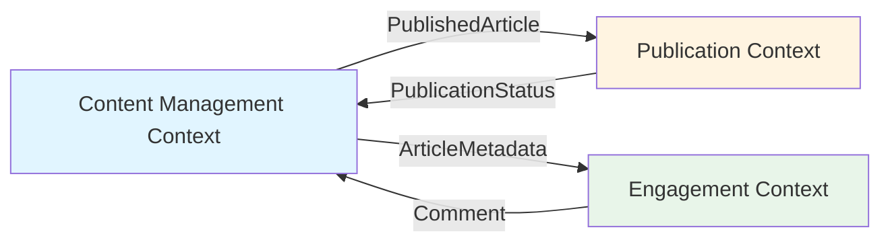
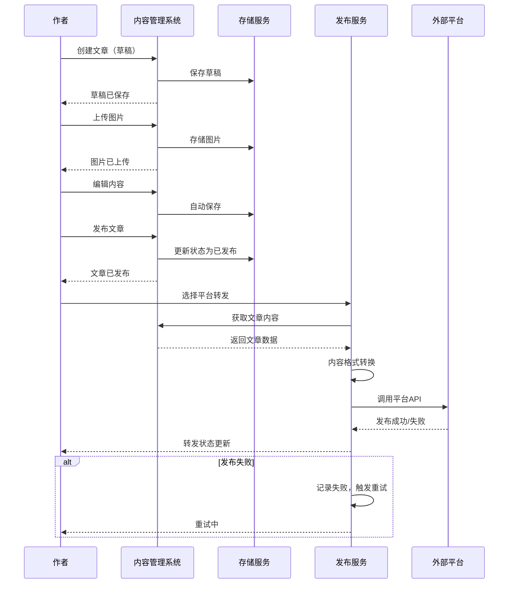
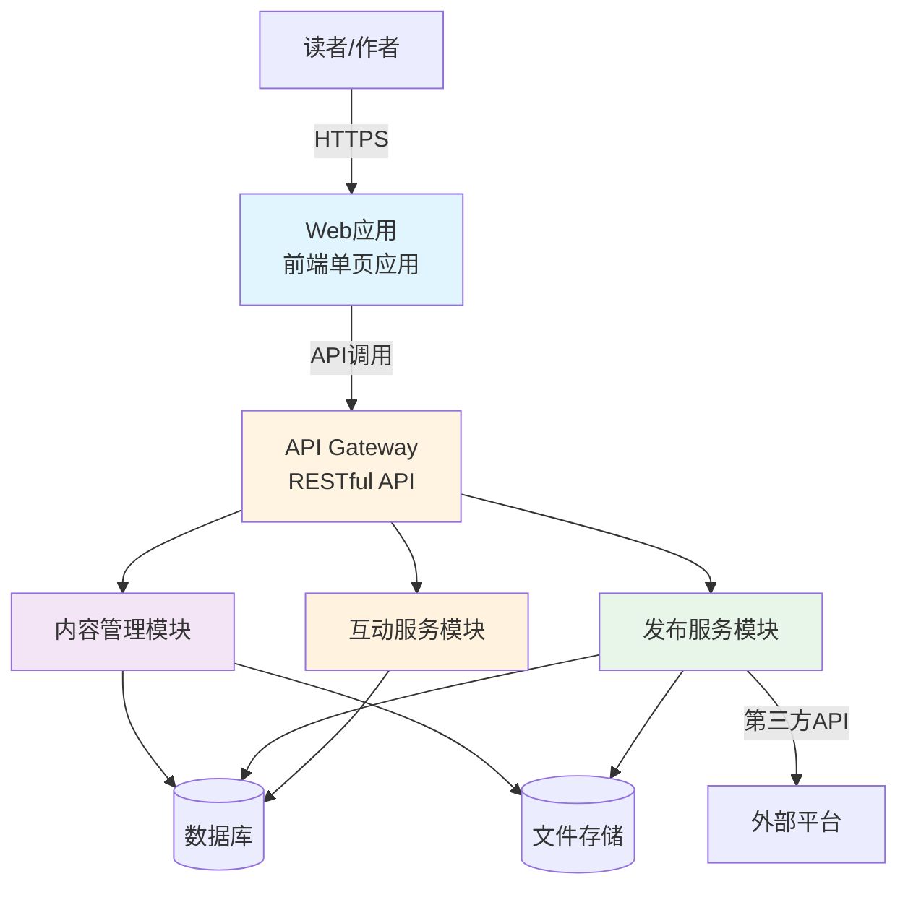
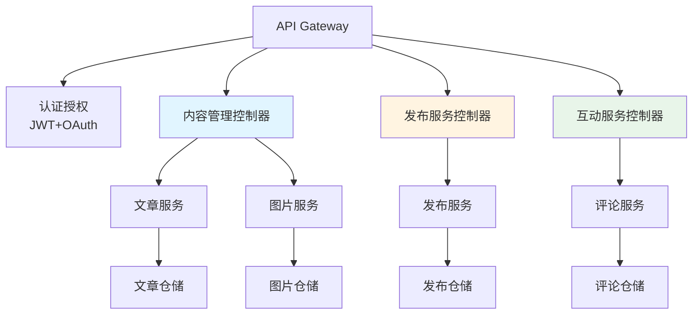
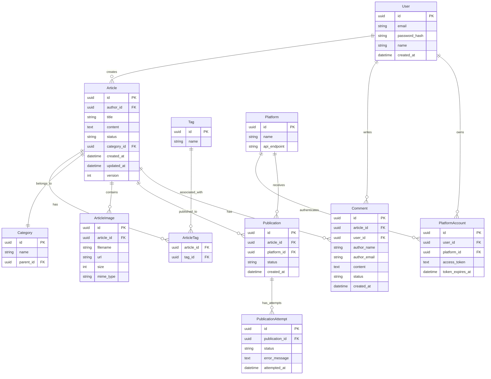

# 个人写作网站系统 - 技术设计

## 1. 设计驱动因素

### 1.1 从规格提取的核心范围
- **核心功能**：文章写作管理、多平台转发、个人站点展示、评论系统
- **用户角色**：作者（管理员）、读者（访客）
- **数据模型**：文章、标签、分类、评论、图片、平台账号、发布记录
- **集成点**：知乎API、X/Twitter API、微博API（可选）

### 1.2 非功能需求映射
| NFR | 映射到设计 |
|-----|----------|
| 性能（<1s加载） | 缓存策略、数据库索引、静态资源CDN |
| 安全（JWT、XSS防护） | 认证授权架构、输入验证、CORS策略 |
| 可用性（>99%） | 容器化部署、健康检查、监控告警 |
| 可扩展性（新增平台） | 适配器模式、插件化架构 |

### 1.3 技术约束
- 全栈应用（前端 + 后端API）
- RESTful API设计
- 容器化部署（Docker）
- 数据库持久化

## 2. Domain Strategic Modeling (DDD)

### 2.1 Bounded Context

基于业务复杂性，识别出3个核心Bounded Context：

#### 2.1.1 Content Management Context
- **Purpose**：管理文章的创建、编辑、组织和发布
- **Core Concepts**：Article、Tag、Category、Draft、Published
- **Language**：文章、草稿、发布、标签、分类、编辑器
- **Ownership**：作者独有，读者只读

#### 2.1.2 Publication Context
- **Purpose**：处理内容到多平台的分发和状态跟踪
- **Core Concepts**：Platform、Publication、Adapter、Status、RetryPolicy
- **Language**：平台、转发、适配器、发布状态、重试
- **Ownership**：作者控制，读者透明

#### 2.1.3 Engagement Context
- **Purpose**：管理读者互动和社交信号
- **Core Concepts**：Comment、Notification、Moderation、SpamFilter
- **Language**：评论、回复、通知、审核、垃圾过滤
- **Ownership**：读者创建，作者审核

### 2.2 Context Map



**关系说明**：
- **CMS → PUB**：Published Article（共享内核），CMS提供文章内容给PUB
- **CMS → ENG**：Article Metadata（防腐层），CMS提供文章元数据供评论关联
- **PUB → CMS**：Publication Status（客户方-供应商），PUB向CMS报告发布状态
- **ENG → CMS**：Comment（开放主机服务），ENG通过事件通知CMS新评论

### 2.3 Ubiquitous Language Glossary

| 术语 | 定义 | 所在Context |
|------|------|-----------|
| 文章 | 包含标题、内容、标签、分类的完整内容单元 | CMS |
| 草稿 | 未发布的文章，可继续编辑 | CMS |
| 发布 | 文章状态的变更，从草稿转为公开可见 | CMS |
| 平台 | 外部内容平台（知乎、X等） | PUB |
| 适配器 | 负责将文章内容转换为目标平台格式的组件 | PUB |
| 转发 | 将已发布文章推送到外部平台的动作 | PUB |
| 评论 | 读者对文章的反馈内容 | ENG |

## 3. Event Storming (Standard Profile)

### 3.1 核心业务流程：文章写作到多平台发布



### 3.2 异常路径

| 异常场景 | 处理策略 |
|---------|---------|
| 图片上传失败 | 返回错误，保留草稿，允许重试 |
| 平台API调用失败 | 记录失败状态，指数退避重试（最多3次） |
| 平台OAuth授权过期 | 提示重新授权，暂停后续转发 |
| 并发编辑冲突 | 乐观锁，后提交者收到冲突提示 |
| 存储空间不足 | 阻止上传，发送告警通知 |

## 4. DDD Tactical Modeling

### 4.1 Content Management Context

#### Aggregates
- **Article Aggregate**：Article（聚合根）、ArticleVersion、ArticleImage
  - 一致性边界：文章内容与图片的原子性更新
  - 并发策略：乐观锁（version字段）

#### Value Objects
- **ArticleContent**：包含markdown内容和元数据
- **ArticleMetadata**：标题、摘要、作者、时间戳
- **ImageMetadata**：文件名、大小、MIME类型、URL

#### Repositories
- **ArticleRepository**：按ID、状态、标签、分类查询
- **ImageRepository**：按文章ID、上传时间查询

#### Domain Services
- **MarkdownRenderer**：Markdown转HTML渲染
- **ImageProcessor**：图片压缩、格式转换

#### Application Services
- **ArticleService**：文章CRUD、发布操作
- **ImageUploadService**：图片上传和管理

#### Domain Events
- **ArticlePublished**：文章发布事件
- **ArticleUpdated**：文章更新事件

### 4.2 Publication Context

#### Aggregates
- **PublicationAggregate**：Publication（聚合根）、PublicationAttempt
  - 一致性边界：发布记录与重试历史的原子性
  - 并发策略：最终一致性

#### Value Objects
- **PlatformCredentials**：OAuth token、API密钥
- **PublicationStatus**：pending、success、failed、retrying

#### Repositories
- **PublicationRepository**：按文章ID、平台、状态查询
- **PlatformAccountRepository**：按用户、平台查询

#### Domain Services
- **ContentAdapter**：内容格式转换（Markdown→平台格式）
- **RateLimiter**：API调用频率限制

#### Application Services
- **PublicationService**：发起转发、状态查询
- **PlatformAuthService**：OAuth授权流程

#### Domain Events
- **PublicationCompleted**：发布成功事件
- **PublicationFailed**：发布失败事件

### 4.3 Engagement Context

#### Aggregates
- **CommentAggregate**：Comment（聚合根）、CommentReply
  - 一致性边界：评论与回复的原子性
  - 并发策略：悲观锁（短时间窗口）

#### Value Objects
- **CommentContent**：评论内容、格式（纯文本/Markdown）
- **CommenterInfo**：昵称、邮箱、IP（可选）

#### Repositories
- **CommentRepository**：按文章ID、状态查询

#### Domain Services
- **SpamFilter**：垃圾评论检测
- **NotificationService**：邮件通知

#### Application Services
- **CommentService**：评论CRUD、审核

#### Domain Events
- **CommentPosted**：新评论事件
- **CommentApproved**：评论审核通过事件

## 5. 候选方案比较

### 5.1 候选方案对比表

| 维度 | 方案A：三层单体架构 | 方案B：微服务架构 | 方案C：模块化单体 |
|------|------------------|----------------|----------------|
| 核心思路 | 前端+后端API+数据库的经典三层 | 按Context拆分独立服务 | 单一部署单元但模块化设计 |
| 最适合场景 | 团队规模小、流量可控 | 大规模、高并发、独立扩展 | 中小规模、演进式架构 |
| 主要收益 | 简单、易开发、成本低 | 独立扩展、技术栈灵活 | 平衡复杂度和灵活性 |
| 主要代价 | 扩展性有限、单点故障 | 运维复杂、分布式事务 | 模块边界需严格维护 |
| 性能匹配度 | ⭐⭐⭐（个人站点足够） | ⭐⭐⭐⭐⭐ | ⭐⭐⭐⭐ |
| 开发成本 | 低 | 高 | 中 |
| 运维成本 | 低 | 高 | 低 |
| 对NFR匹配 | 满足性能、安全要求 | 过度设计 | 最佳平衡 |
| 对后续task影响 | 任务拆解简单 | 任务复杂度高 | 任务清晰度适中 |

### 5.2 选定方案：方案C - 模块化单体架构

**选定理由**：
1. **复杂度适配**：solo项目，不需要微服务的分布式复杂性
2. **演进路径**：从模块化单体可以平滑演进到微服务（如果未来需要）
3. **技术栈统一**：降低开发和维护成本
4. **满足NFR**：性能、安全、可用性都能满足
5. **符合DDD边界**：模块边界与Bounded Context一致

## 6. 架构设计

### 6.1 逻辑架构（C4 Context View）



### 6.2 组件架构（C4 Component View）



### 6.3 数据模型（简化ERD）



### 6.5 技术栈选型

#### 6.5.1 前端技术栈

| 技术层次 | 选型 | 版本 | 理由 |
|---------|------|------|------|
| **框架** | Vue 3 | 3.4+ | Composition API、响应式系统、生态成熟 |
| **构建工具** | Vite | 5.0+ | 快速热更新、ESM原生支持、开发体验优秀 |
| **UI组件库** | Naive UI | 2.38+ | Vue 3原生、TypeScript友好、组件丰富 |
| **CSS方案** | Tailwind CSS | 4.0+ | 原子化CSS、高度可定制、响应式友好 |
| **状态管理** | Pinia | 2.1+ | Vue 3官方推荐、TypeScript支持、devtools集成 |
| **路由** | Vue Router | 4.2+ | Vue生态、动态路由、导航守卫 |
| **HTTP客户端** | fetch API | 原生 | 零依赖、现代浏览器支持 |
| **Markdown渲染** | markdown-it | 14.0+ | 插件生态、性能优秀、安全性好 |
| **代码高亮** | highlight.js | 11.9+ | 语言支持广、主题丰富 |
| **测试框架** | Vitest | 1.0+ | Vite原生、 Jest兼容、速度快 |

#### 6.5.2 后端技术栈

| 技术层次 | 选型 | 版本 | 理由 |
|---------|------|------|------|
| **框架** | Spring Boot | 3.2.0 | 企业级框架、生态成熟、自动配置 |
| **Java版本** | Java | 17 | LTS版本、性能优化、长期支持 |
| **构建工具** | Maven | 3.9+ | 依赖管理、标准化构建、插件丰富 |
| **Web框架** | Spring WebMVC | 6.1+ | RESTful支持、注解驱动、集成容易 |
| **数据访问** | Spring Data JPA | 3.2+ | Repository模式、自动查询生成、审计支持 |
| **数据库** | H2 (开发) | 2.2+ | 内存数据库、快速启动、无需安装 |
| **数据库** | PostgreSQL (生产) | 15+ | ACID事务、JSON支持、成熟稳定 |
| **安全认证** | Spring Security + JWT | 6.2+ | 安全框架、JWT无状态、OAuth支持 |
| **API文档** | SpringDoc OpenAPI | 2.3+ | OpenAPI 3.0、Swagger UI、自动生成 |
| **工具库** | Lombok | 1.18+ | 减少样板代码、编译时生成、提高效率 |

#### 6.5.3 开发工具栈

| 工具类型 | 选型 | 用途 |
|---------|------|------|
| **版本控制** | Git | 源代码管理 |
| **容器化** | Docker + Docker Compose | 开发环境、生产部署 |
| **CI/CD** | GitHub Actions | 自动化测试、自动部署 |
| **代码质量** | ESLint + Prettier (前端) | 代码规范、格式化 |
| **类型检查** | TypeScript (前端) | 静态类型检查 |
| **API测试** | Postman / REST Client | API调试、测试 |

#### 6.5.4 技术栈架构图

```
┌─────────────────────────────────────────────────────────┐
│                     前端 (Vue 3)                         │
│  ┌──────────┐  ┌──────────┐  ┌──────────┐  ┌─────────┐ │
│  │  Views   │  │Components│  │  Stores  │  │ Utils   │ │
│  └──────────┘  └──────────┘  └──────────┘  └─────────┘ │
│         ↓                     ↓                    ↓    │
│  ┌──────────────────────────────────────────────────┐  │
│  │              Vue Router + Pinia                   │  │
│  └──────────────────────────────────────────────────┘  │
└─────────────────────────────────────────────────────────┘
                          ↓ HTTP/REST
┌─────────────────────────────────────────────────────────┐
│              后端 (Spring Boot 3.2)                      │
│  ┌──────────────────────────────────────────────────┐  │
│  │            Controllers (REST APIs)                │  │
│  └──────────────────────────────────────────────────┘  │
│         ↓                     ↓                    ↓    │
│  ┌──────────┐  ┌──────────┐  ┌──────────┐  ┌─────────┐ │
│  │ Services │  │Repositories│  │Entities  │  │ Security│ │
│  └──────────┘  └──────────┘  └──────────┘  └─────────┘ │
│         ↓                                                  │
│  ┌──────────────────────────────────────────────────┐  │
│  │         Spring Data JPA (Hibernate)               │  │
│  └──────────────────────────────────────────────────┘  │
└─────────────────────────────────────────────────────────┘
                          ↓
┌─────────────────────────────────────────────────────────┐
│           数据库 (PostgreSQL / H2)                        │
└─────────────────────────────────────────────────────────┘
```

#### 6.5.5 技术栈选择理由

**前端选择 Vue 3 而非 React 的理由**：
- 学习曲线更平缓，适合快速开发
- Composition API 提供更好的 TypeScript 支持
- 单文件组件 (SFC) 保持逻辑、样式、模板在一起
- Pinia 状态管理比 Redux 更简洁

**后端选择 Spring Boot 而非 Node.js 的理由**：
- 企业级框架，稳定性和可维护性更高
- 类型安全（Java 强类型），减少运行时错误
- Spring 生态系统完善（Security、Data JPA、Redis 等）
- 数据库事务和持久化更成熟
- 便于团队协作和代码审查
- 性能优异（JVM 优化）
- 微服务演进路径清晰

**选择 PostgreSQL 而非 MongoDB 的理由**：
- 关系型数据模型更适合文章管理系统
- ACID 事务保证数据一致性
- JSON 字段支持灵活的扩展
- 全文搜索能力（pg_trgm、tsvector）
- 成熟的备份和恢复方案

## 7. 关键技术决策（ADRs）

### ADR-0001: 选择模块化单体架构
**Status**: Proposed
**Context**: 需要构建个人写作网站，涉及内容管理、多平台发布、评论系统三大功能模块
**Decision**: 采用模块化单体架构而非微服务
**Consequences**:
- + 降低运维复杂度
- + 统一技术栈
- + 简化开发和测试
- - 水平扩展受限（但对个人站点不是问题）
- + 模块边界清晰，未来可拆分微服务

### ADR-0002: RESTful API + JWT认证
**Status**: Proposed
**Context**: 前后端分离架构，需要安全的API访问控制
**Decision**:
- API设计遵循RESTful规范
- 使用JWT进行认证授权
- OAuth 2.0用于第三方平台授权
**Consequences**:
- + 标准化API设计
- + 无状态认证
- + 良好的跨平台支持
- - Token刷新需要额外处理

### ADR-0003: 数据库选型 - PostgreSQL
**Status**: Proposed
**Context**: 需要存储结构化数据，支持复杂查询和事务
**Decision**: 使用PostgreSQL作为主数据库
**Consequences**:
- + ACID事务支持
- + JSON字段支持灵活schema
- + 成熟的ORM支持
- - 需要独立部署数据库

### ADR-0004: 文件存储策略 - 本地存储+CDN备选
**Status**: Proposed
**Context**: 需要存储用户上传的图片
**Decision**: 初期使用本地存储，预留CDN集成接口
**Consequences**:
- + 零额外成本
- + 实现简单
- - 缺乏CDN加速
- + 预留扩展接口，后期可切换到云存储

### ADR-0005: 多平台适配器模式
**Status**: Proposed
**Context**: 需要支持多个内容平台的API集成
**Decision**: 使用适配器模式封装各平台API差异
**Consequences**:
- + 统一的内容发布接口
- + 易于添加新平台支持
- - 每个平台需要单独适配器开发
- + 平台API变更隔离

## 8. 非功能需求实现策略

### 8.1 性能优化
| NFR要求 | 实现策略 |
|---------|---------|
| 文章列表<1s | 数据库索引、分页查询、Redis缓存 |
| 文章详情<1.5s | 内容缓存、图片懒加载、CDN |
| 图片上传<3s | 异步上传、进度反馈、压缩优化 |
| 1000+文章 | 分区表、索引优化、归档策略 |

### 8.2 安全措施
| 安全要求 | 实现策略 |
|---------|---------|
| 用户认证 | JWT + refreshToken机制 |
| XSS防护 | 输入验证、输出转义、Content Security Policy |
| CSRF防护 | CSRF Token、SameSite Cookie |
| 文件上传 | 类型校验、大小限制、病毒扫描 |
| API密钥 | 加密存储、密钥轮换、访问审计 |

### 8.3 可用性保障
| 可用性要求 | 实现策略 |
|-----------|---------|
| 系统可用性>99% | 容器化部署、健康检查、自动重启 |
| 数据备份 | 定期备份、异地备份、恢复演练 |
| 错误日志 | 结构化日志、日志聚合、告警通知 |

### 8.4 可扩展性设计
| 扩展性要求 | 实现策略 |
|-----------|---------|
| 新增平台 | 适配器接口、配置化平台信息 |
| 主题扩展 | 主题系统、组件化设计 |
| API接口化 | 版本化API、文档生成 |

## 9. 失败模式分析

### 9.1 关键路径失败模式

| 组件 | 失败模式 | 影响 | 缓解策略 |
|------|---------|------|---------|
| 数据库 | 连接失败 | 无法读写 | 连接池、重试、降级到缓存 |
| 文件存储 | 磁盘满 | 无法上传 | 容量监控、自动清理、告警 |
| 外部API | 调用超时 | 转发失败 | 超时控制、重试、降级 |
| 图片处理 | 内存溢出 | 上传失败 | 大小限制、流式处理 |
| 缓存 | 缓存雪崩 | 性能下降 | 限流、降级、熔断 |

### 9.2 错误处理四层次
1. **重试**：网络超时、临时性故障（指数退避）
2. **降级**：非核心功能不可用时保证核心可用
3. **熔断**：连续失败时暂时停止调用
4. **告警**：严重错误时通知运维人员

## 10. STRIDE威胁建模

| 威胁类型 | 描述 | 缓解措施 |
|---------|------|---------|
| **S**poofing | 伪造用户身份、第三方平台账号 | JWT验证、OAuth 2.0、CSRF Token |
| **T**ampering | 篡改文章内容、评论内容 | 签名验证、版本控制、审计日志 |
| **R**epudiation | 否认操作（发布、删除） | 操作日志、不可变日志 |
| **I**nformation Disclosure | 敏感信息泄露（API密钥、用户数据） | 加密存储、最小权限原则、数据脱敏 |
| **D**enial of Service | 恶意请求导致服务不可用 | 限流、验证码、IP黑名单 |
| **E**levation of Privilege | 权限提升（普通用户获取管理员权限） | RBAC、最小权限、定期审计 |

## 11. 测试策略

### 11.1 测试金字塔
```
    E2E测试（10%）
   ↑
    集成测试（30%）
   ↑
    单元测试（60%）
```

### 11.2 关键测试路径
1. **文章CRUD流程**：创建→编辑→发布→展示
2. **图片上传流程**：上传→压缩→存储→展示
3. **多平台转发流程**：授权→转换→发布→状态跟踪
4. **评论流程**：发表→审核→通知→展示

### 11.3 验证方法
- **性能验证**：压力测试、基准测试
- **安全验证**：渗透测试、依赖扫描
- **可用性验证**：健康检查、故障注入

## 12. 任务规划准备度

### 12.1 已明确的边界
- ✅ Bounded Context清晰（CMS、Publication、Engagement）
- ✅ 模块边界明确（3个核心模块）
- ✅ 数据模型完整（7个核心实体）
- ✅ API契约可定义（RESTful接口）
- ✅ 部署架构清晰（容器化单体）

### 12.2 可直接拆分为任务的部分
- 前端框架搭建和路由配置
- 数据库Schema设计和迁移
- 认证授权实现
- 文章CRUD API
- 图片上传服务
- 评论系统
- 各平台适配器开发

### 12.3 需要在实现时澄清的细节
- 具体前端框架选择（React vs Vue vs Angular）
- 具体ORM选择
- 图片处理库选择
- 缓存策略具体实现

## 13. 排除项和延后项

### 13.1 排除项（不在本功能范围）
- 多人协作写作
- 文章导入/导出
- 实时协作编辑
- 移动App

### 13.2 延后项（Phase 2+）
- 高级SEO优化（结构化数据）
- 图片CDN集成
- 定时发布功能
- 评论社交登录
- 数据分析统计

## 14. 开放问题

### 14.1 已解决（已在设计中决策）
- ✅ 架构模式：模块化单体
- ✅ 数据库：PostgreSQL
- ✅ API设计：RESTful + JWT
- ✅ 文件存储：本地存储+CDN接口

### 14.2 待实现时选择（非阻塞）
- ⏸️ **ORM选择**：Prisma/Drizzle ORM（推荐Prisma，类型安全）
- ⏸️ **图片处理库**：Sharp（推荐）或Jimp
- ⏸️ **缓存方案**：初期使用内存缓存，预留Redis接口

## 15. Peer依赖交接（与hf-ui-design）

### 15.1 UI设计需要依赖的技术决策
- **API端点设计**：已定义RESTful接口规范，UI可依赖的API契约
- **认证流程**：JWT + OAuth 2.0，UI需要实现的登录/授权界面
- **文件上传接口**：图片上传的API规范，UI需要实现的上传组件
- **状态管理**：前后端分离，UI需要管理客户端状态

### 15.2 技术设计依赖UI设计的部分
- **前端框架选型**：技术设计中的API设计需要适配前端框架
- **图片上传组件**：服务端实现需要配合UI的上传组件
- **错误展示策略**：API错误响应格式需要UI的错误展示机制

## 16. 参考文档关联

- **需求规格**：`features/001-personal-writing-platform/spec.md`
- **进度追踪**：`features/001-personal-writing-platform/progress.md`
- **架构决策记录**：`docs/adr/ADR-0001` ~ `docs/adr/ADR-0005`
- **后续任务**：待`hf-tasks`拆解

---

**设计版本**: 1.0
**最后更新**: 2026-05-08
**状态**: 草稿（待评审）
