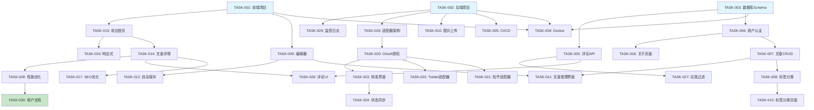

# 个人写作网站系统 - 任务计划

## 概述

本文档将已批准的需求规格和技术设计转化为可执行、可追溯、可验证的开发任务。

**Feature ID**: 001-personal-writing-platform
**版本**: 1.0
**创建日期**: 2026-05-08
**技术栈**: Vue 3 + Vite + Naive UI + Tailwind CSS + Node.js + PostgreSQL

---

## 里程碑规划

### Milestone 1: 项目基础设施搭建
**目标**: 建立开发环境和基础架构
**包含任务**: TASK-001 ~ TASK-005
**退出标准**:
- ✅ 前端和后端项目可独立启动
- ✅ 数据库Schema创建并迁移
- ✅ Docker容器可本地运行
- ✅ CI/CD pipeline配置完成

### Milestone 2: 核心写作功能
**目标**: 实现文章写作和管理功能
**包含任务**: TASK-006 ~ TASK-012
**退出标准**:
- ✅ 用户可以创建、编辑、删除文章
- ✅ Markdown编辑器实时预览
- ✅ 图片上传和管理
- ✅ 自动保存草稿

### Milestone 3: 网站展示
**目标**: 实现个人站点前台展示
**包含任务**: TASK-013 ~ TASK-018
**退出标准**:
- ✅ 首页展示文章列表
- ✅ 文章详情页正常显示
- ✅ 响应式设计完成
- ✅ SEO优化实现

### Milestone 4: 多平台转发
**目标**: 实现一键转发到外部平台
**包含任务**: TASK-019 ~ TASK-024
**退出标准**:
- ✅ 支持知乎和X/Twitter转发
- ✅ OAuth授权流程
- ✅ 内容格式转换
- ✅ 转发状态跟踪

### Milestone 5: 评论系统和优化
**目标**: 完善评论功能和系统优化
**包含任务**: TASK-025 ~ TASK-030
**退出标准**:
- ✅ 读者可以发表评论
- ✅ 评论审核和通知
- ✅ 性能优化完成
- ✅ 系统监控和日志

---

## 工件影响图

### 新建文件
```
project-root/
├── frontend/                      # Vue前端项目
│   ├── src/
│   │   ├── components/           # Atomic组件
│   │   ├── views/                # 页面视图
│   │   ├── stores/               # Pinia状态管理
│   │   ├── api/                  # API客户端
│   │   ├── types/                # TypeScript类型
│   │   └── utils/                # 工具函数
│   ├── tailwind.config.js        # Tailwind配置
│   ├── vite.config.ts            # Vite配置
│   └── package.json
├── backend/                       # Node.js后端项目
│   ├── src/
│   │   ├── modules/              # 业务模块
│   │   │   ├── content/          # 内容管理模块
│   │   │   ├── publication/      # 发布服务模块
│   │   │   └── engagement/       # 互动系统模块
│   │   ├── database/             # 数据库
│   │   │   ├── migrations/       # 迁移文件
│   │   │   ├── repositories/     # 数据仓储
│   │   │   └── models/           # 数据模型
│   │   ├── services/             # 领域服务
│   │   ├── controllers/          # API控制器
│   │   ├── middleware/           # 中间件
│   │   └── utils/                # 工具函数
│   └── package.json
├── docker-compose.yml            # Docker编排
├── Dockerfile.frontend
├── Dockerfile.backend
└── .github/workflows/            # CI/CD配置
```

### 修改文件
- README.md（添加项目说明）
- .gitignore（忽略node_modules、环境变量）

---

## 任务详情

### Milestone 1: 项目基础设施搭建

#### TASK-001: 初始化前端项目
**ID**: TASK-001
**目标**: 创建Vue 3前端项目并配置开发环境

**Acceptance**:
- ✅ 使用Vite创建Vue 3项目
- ✅ 配置TypeScript支持
- ✅ 集成Tailwind CSS
- ✅ 配置Naive UI组件库
- ✅ 配置Vue Router
- ✅ 配置Pinia状态管理
- ✅ 开发服务器可启动（localhost:5173）

**Files**:
- `frontend/package.json`
- `frontend/vite.config.ts`
- `frontend/tailwind.config.js`
- `frontend/src/main.ts`

**Verify**:
```bash
cd frontend && npm install
npm run dev
# 访问 http://localhost:5173 确认启动成功
```

**完成条件**:
- 前端项目可在开发模式运行
- Naive UI组件可正常导入使用
- Tailwind CSS样式生效

**测试设计种子**:
- 主行为：渲染Naive UI Button组件
- 关键边界：Tailwind类名应用
- fail-first点：使用不存在的组件应报错

---

#### TASK-002: 初始化后端项目
**ID**: TASK-002
**目标**: 创建Node.js后端项目并配置基础架构

**Acceptance**:
- ✅ 使用Express.js创建后端项目
- ✅ 配置TypeScript支持
- ✅ 配置ESLint和Prettier
- ✅ 配置环境变量管理（dotenv）
- ✅ 配置日志系统（Winston）
- ✅ 创建基础中间件（CORS、Body Parser、错误处理）
- ✅ 服务器可启动（localhost:3000）

**Files**:
- `backend/package.json`
- `backend/src/server.ts`
- `backend/src/middleware/cors.ts`
- `backend/src/middleware/errorHandler.ts`
- `backend/src/utils/logger.ts`

**Verify**:
```bash
cd backend && npm install
npm run dev
# curl http://localhost:3000/health 应返回200
```

**完成条件**:
- 后端服务器健康检查端点正常
- 请求日志正常输出
- 错误处理中间件捕获异常

**测试设计种子**:
- 主行为：GET /health返回200
- 关键边界：CORS头正确设置
- fail-first点：无效路由返回404

---

#### TASK-003: 设计并创建数据库Schema
**ID**: TASK-003
**目标**: 创建PostgreSQL数据库Schema和迁移文件

**Acceptance**:
- ✅ 设计7个核心表：users, articles, tags, categories, article_tags, article_images, comments
- ✅ 设计3个发布相关表：platforms, platform_accounts, publications, publication_attempts
- ✅ 创建迁移文件（选择Prisma或Drizzle ORM）
- ✅ 定义索引和外键约束
- ✅ 执行迁移并验证Schema

**Files**:
- `backend/database/migrations/001_initial_schema.sql`
- `backend/database/schema.prisma`（如果使用Prisma）
- `backend/database/models/*.ts`

**Verify**:
```bash
# 连接数据库
psql -U postgres -d writing_platform

# 验证表创建
\dt

# 验证索引
\di

# 验证外键
SELECT * FROM information_schema.table_constraints
WHERE constraint_type = 'FOREIGN KEY';
```

**完成条件**:
- 所有表创建成功
- 外键约束生效
- 索引创建成功
- 迁移可回滚

**测试设计种子**:
- 主行为：插入测试数据
- 关键边界：外键约束阻止无效插入
- fail-first点：重复唯一键应报错

**依赖**: TASK-002

---

#### TASK-004: 配置Docker容器化
**ID**: TASK-004
**目标**: 创建Docker配置实现容器化部署

**Acceptance**:
- ✅ 创建Dockerfile.frontend（多阶段构建）
- ✅ 创建Dockerfile.backend（多阶段构建）
- ✅ 创建docker-compose.yml（包含frontend、backend、postgres）
- ✅ 配置容器间网络通信
- ✅ 配置卷挂载（数据库持久化）
- ✅ 容器可一键启动

**Files**:
- `Dockerfile.frontend`
- `Dockerfile.backend`
- `docker-compose.yml`

**Verify**:
```bash
docker-compose up -d
# 检查容器状态
docker-compose ps
# 检查日志
docker-compose logs backend
```

**完成条件**:
- 所有容器正常运行
- 前后端可互相通信
- 数据库数据持久化
- 容器重启后数据不丢失

**测试设计种子**:
- 主行为：docker-compose up启动所有服务
- 关键边界：容器间网络通信
- fail-first点：数据库容器失败时后端应报错

**依赖**: TASK-001, TASK-002, TASK-003

---

#### TASK-005: 配置CI/CD Pipeline
**ID**: TASK-005
**目标**: 配置GitHub Actions实现自动化测试和部署

**Acceptance**:
- ✅ 创建前端CI配置（lint、test、build）
- ✅ 创建后端CI配置（lint、test、build）
- ✅ 配置自动化测试运行
- ✅ 配置Docker镜像构建和推送
- ✅ 配置部署脚本（可选）

**Files**:
- `.github/workflows/frontend-ci.yml`
- `.github/workflows/backend-ci.yml`

**Verify**:
```bash
# 推送代码触发CI
git push origin main
# 在GitHub Actions页面检查工作流运行状态
```

**完成条件**:
- CI工作流自动触发
- Lint检查正常运行
- 测试自动执行
- Docker镜像自动构建

**依赖**: TASK-001, TASK-002

---

### Milestone 2: 核心写作功能

#### TASK-006: 实现用户认证系统
**ID**: TASK-006
**目标**: 实现用户注册、登录、JWT认证

**Acceptance**:
- ✅ 实现用户注册API（POST /api/v1/auth/register）
- ✅ 实现用户登录API（POST /api/v1/auth/login）
- ✅ 实现JWT Token生成和验证
- ✅ 实现Token刷新机制（refreshToken）
- ✅ 创建认证中间件（requireAuth）
- ✅ 前端登录页面（Naive UI表单）
- ✅ 前端Token存储和自动刷新

**Files**:
- `backend/src/modules/auth/auth.controller.ts`
- `backend/src/modules/auth/auth.service.ts`
- `backend/src/modules/auth/jwt.ts`
- `backend/src/middleware/auth.ts`
- `frontend/src/views/Login.vue`
- `frontend/src/stores/auth.ts`
- `frontend/src/api/auth.ts`

**Verify**:
```bash
# 注册新用户
curl -X POST http://localhost:3000/api/v1/auth/register \
  -H "Content-Type: application/json" \
  -d '{"email":"test@example.com","password":"password123","name":"Test User"}'

# 登录获取Token
curl -X POST http://localhost:3000/api/v1/auth/login \
  -H "Content-Type: application/json" \
  -d '{"email":"test@example.com","password":"password123"}'

# 使用Token访问受保护路由
curl http://localhost:3000/api/v1/articles \
  -H "Authorization: Bearer <token>"
```

**完成条件**:
- 用户可成功注册和登录
- JWT Token正确验证
- Token过期后自动刷新
- 受保护路由需要认证

**测试设计种子**:
- 主行为：登录成功返回Token
- 关键边界：错误密码返回401
- fail-first点：无效Token被拒绝

**依赖**: TASK-002, TASK-003

---

#### TASK-007: 实现文章CRUD API
**ID**: TASK-007
**目标**: 实现文章的创建、读取、更新、删除API

**Acceptance**:
- ✅ 创建文章API（POST /api/v1/articles）
- ✅ 获取文章列表API（GET /api/v1/articles）
- ✅ 获取文章详情API（GET /api/v1/articles/:id）
- ✅ 更新文章API（PUT /api/v1/articles/:id）
- ✅ 删除文章API（DELETE /api/v1/articles/:id）
- ✅ 发布文章API（POST /api/v1/articles/:id/publish）
- ✅ 乐观锁版本控制（version字段）

**Files**:
- `backend/src/modules/content/articles.controller.ts`
- `backend/src/modules/content/articles.service.ts`
- `backend/src/database/repositories/article.repository.ts`
- `backend/src/database/models/article.model.ts`

**Verify**:
```bash
# 创建文章
curl -X POST http://localhost:3000/api/v1/articles \
  -H "Authorization: Bearer <token>" \
  -H "Content-Type: application/json" \
  -d '{"title":"Test Article","content":"# Hello World\n\nThis is a test.","categoryId":"uuid"}'

# 获取文章列表
curl http://localhost:3000/api/v1/articles

# 更新文章
curl -X PUT http://localhost:3000/api/v1/articles/:id \
  -H "Authorization: Bearer <token>" \
  -H "Content-Type: application/json" \
  -d '{"title":"Updated Title"}'
```

**完成条件**:
- 文章CRUD操作正常
- 版本冲突检测生效
- 只能操作自己的文章
- 删除文章为软删除

**测试设计种子**:
- 主行为：创建文章并返回ID
- 关键边界：版本冲突返回409
- fail-first点：删除不存在的文章返回404

**依赖**: TASK-003, TASK-006

---

#### TASK-008: 实现标签和分类系统
**ID**: TASK-008
**目标**: 实现文章标签和分类管理功能

**Acceptance**:
- ✅ 创建标签API（POST /api/v1/tags）
- ✅ 获取标签列表API（GET /api/v1/tags）
- ✅ 创建分类API（POST /api/v1/categories）
- ✅ 获取分类树API（GET /api/v1/categories）
- ✅ 文章关联标签（多对多）
- ✅ 文章关联分类（多对一）
- ✅ 按标签/分类筛选文章

**Files**:
- `backend/src/modules/content/tags.controller.ts`
- `backend/src/modules/content/categories.controller.ts`
- `backend/src/database/repositories/tag.repository.ts`
- `backend/src/database/repositories/category.repository.ts`

**Verify**:
```bash
# 创建标签
curl -X POST http://localhost:3000/api/v1/tags \
  -H "Authorization: Bearer <token>" \
  -H "Content-Type: application/json" \
  -d '{"name":"tech"}'

# 按标签筛选文章
curl "http://localhost:3000/api/v1/articles?tag=tech"
```

**完成条件**:
- 标签和分类CRUD正常
- 文章可关联多个标签
- 分类支持层级结构
- 筛选功能正常

**依赖**: TASK-007

---

#### TASK-009: 实现Markdown编辑器组件
**ID**: TASK-009
**目标**: 实现分屏Markdown编辑器组件

**Acceptance**:
- ✅ 左侧Markdown编辑区（支持语法高亮）
- ✅ 右侧实时预览区
- ✅ 工具栏（加粗、斜体、标题、列表、代码块）
- ✅ 快捷键支持（Ctrl+B、Ctrl+I等）
- ✅ 同步滚动
- ✅ 自动保存草稿（每30秒）
- ✅ 支持图片粘贴上传

**Files**:
- `frontend/src/components/editor/MarkdownEditor.vue`
- `frontend/src/components/editor/EditorToolbar.vue`
- `frontend/src/components/editor/PreviewPane.vue`
- `frontend/src/utils/markdown.ts`

**Verify**:
- 手动测试：输入Markdown文本，预览区实时更新
- 快捷键测试：Ctrl+B选中文本变粗体
- 自动保存测试：停止输入30秒后检查localStorage

**完成条件**:
- 编辑器和预览区正常显示
- 实时预览无延迟
- 快捷键正常工作
- 自动保存触发

**测试设计种子**:
- 主行为：输入Markdown转换为HTML
- 关键边界：图片上传失败处理
- fail-first点：无效Markdown语法不崩溃

**依赖**: TASK-001

---

#### TASK-010: 实现图片上传和管理
**ID**: TASK-010
**目标**: 实现图片上传、存储和管理功能

**Acceptance**:
- ✅ 图片上传API（POST /api/v1/images/upload）
- ✅ 支持拖拽上传
- ✅ 支持粘贴上传
- ✅ 图片格式验证（JPG、PNG、GIF、WebP）
- ✅ 图片大小限制（5MB）
- ✅ 图片压缩和优化（Sharp库）
- ✅ 生成缩略图
- ✅ 图片管理界面（网格展示）
- ✅ 图片删除和替换

**Files**:
- `backend/src/modules/content/images.controller.ts`
- `backend/src/modules/content/images.service.ts`
- `backend/src/utils/imageProcessor.ts`
- `frontend/src/components/ImageViewer.vue`
- `frontend/src/components/ImageUploader.vue`
- `frontend/src/stores/images.ts`

**Verify**:
```bash
# 上传图片
curl -X POST http://localhost:3000/api/v1/images/upload \
  -H "Authorization: Bearer <token>" \
  -F "file=@test.jpg"

# 验证图片文件存在
ls backend/uploads/images/
```

**完成条件**:
- 图片上传成功
- 压缩图片质量可接受
- 缩略图正确生成
- 图片管理界面正常

**测试设计种子**:
- 主行为：上传图片返回URL
- 关键边界：超过5MB返回错误
- fail-first点：上传非图片文件被拒绝

**依赖**: TASK-002, TASK-004

---

#### TASK-011: 实现文章管理界面
**ID**: TASK-011
**目标**: 实现文章列表、编辑、删除管理界面

**Acceptance**:
- ✅ 文章列表页面（卡片式布局）
- ✅ 状态筛选（全部、已发布、草稿）
- ✅ 搜索功能（按标题和内容）
- ✅ 新建文章按钮
- ✅ 编辑文章入口
- ✅ 删除文章确认对话框
- ✅ 分页控件

**Files**:
- `frontend/src/views/ArticleList.vue`
- `frontend/src/views/ArticleEdit.vue`
- `frontend/src/components/ArticleCard.vue`
- `frontend/src/components/ArticleFilter.vue`

**Verify**:
- 手动测试：文章列表正常显示
- 搜索测试：输入关键词过滤文章
- 分页测试：翻页正常工作
- 删除测试：删除确认对话框显示

**完成条件**:
- 文章列表正确显示
- 搜索和筛选功能正常
- 分页控件工作正常
- 删除操作有确认

**依赖**: TASK-007, TASK-009, TASK-010

---

#### TASK-012: 实现自动保存草稿
**ID**: TASK-012
**目标**: 实现文章编辑时自动保存草稿

**Acceptance**:
- ✅ 编辑器停止输入30秒后自动保存
- ✅ 显示"最后保存时间"提示
- ✅ 保存成功显示Toast提示
- ✅ 保存失败显示错误提示
- ✅ 刷新页面后恢复草稿
- ✅ 手动保存按钮（Ctrl+S）

**Files**:
- `frontend/src/utils/autoSave.ts`
- `frontend/src/components/editor/AutoSaveIndicator.vue`

**Verify**:
- 手动测试：停止输入30秒后检查保存状态
- 快捷键测试：按Ctrl+S触发手动保存
- 刷新测试：编辑后刷新，内容恢复

**完成条件**:
- 自动保存功能正常
- 保存状态正确显示
- 草稿正确恢复
- 手动保存快捷键生效

**依赖**: TASK-009, TASK-011

---

### Milestone 3: 网站展示

#### TASK-013: 实现前台首页布局
**ID**: TASK-013
**目标**: 实现前台首页和导航布局

**Acceptance**:
- ✅ 简洁导航栏（Logo、文章、关于）
- ✅ Hero区域（欢迎标题、简介）
- ✅ 文章列表展示
- ✅ 响应式布局（移动端适配）
- ✅ 页脚（版权信息、社交链接）
- ✅ SEO优化（meta标签、结构化数据）

**Files**:
- `frontend/src/views/Home.vue`
- `frontend/src/components/layout/Header.vue`
- `frontend/src/components/layout/Footer.vue`
- `frontend/src/components/ArticlePreview.vue`

**Verify**:
- 访问首页检查布局
- 调整浏览器窗口大小检查响应式
- 查看页面源代码检查meta标签

**完成条件**:
- 首页布局正确显示
- 响应式适配正常
- SEO meta标签完整

**依赖**: TASK-001

---

#### TASK-014: 实现文章详情页
**ID**: TASK-014
**目标**: 实现文章阅读页面

**Acceptance**:
- ✅ 文章标题和元信息显示
- ✅ Markdown内容渲染（代码高亮）
- ✅ 文章目录（TOC）自动生成
- ✅ 阅读进度条
- ✅ 上一篇/下一篇导航
- ✅ 分享按钮（复制链接）

**Files**:
- `frontend/src/views/ArticleDetail.vue`
- `frontend/src/components/TOC.vue`
- `frontend/src/components/ReadingProgress.vue`

**Verify**:
- 访问文章详情页检查显示
- 检查代码高亮效果
- 测试目录点击跳转
- 测试分享功能

**完成条件**:
- 文章内容正确渲染
- 代码高亮正常
- 目录跳转工作
- 阅读进度条显示

**依赖**: TASK-013

---

#### TASK-015: 实现标签和分类页面
**ID**: TASK-015
**目标**: 实现标签云和分类归档页面

**Acceptance**:
- ✅ 标签云页面（标签大小反映文章数量）
- ✅ 分类树展示
- ✅ 按标签筛选文章列表
- ✅ 按分类筛选文章列表
- ✅ URL路由（/tags/:name, /categories/:id）

**Files**:
- `frontend/src/views/TagCloud.vue`
- `frontend/src/views/CategoryArchive.vue`
- `frontend/src/components/TagBadge.vue`

**Verify**:
- 访问标签云页面检查显示
- 点击标签跳转到文章列表
- 访问分类页面检查层级

**完成条件**:
- 标签云正确显示
- 分类树正确显示
- 筛选功能正常

**依赖**: TASK-008, TASK-013

---

#### TASK-016: 实现响应式设计
**ID**: TASK-016
**目标**: 优化移动端和平板端显示

**Acceptance**:
- ✅ 移动端导航（汉堡菜单）
- ✅ 平板端文章列表（2列网格）
- ✅ 移动端编辑器（上下分屏）
- ✅ 触摸操作优化
- ✅ 移动端图片上传（相机支持）

**Files**:
- `frontend/src/components/responsive/MobileMenu.vue`
- `frontend/src/components/responsive/TabletGrid.vue`
- `frontend/src/styles/responsive.css`

**Verify**:
- Chrome DevTools模拟移动设备测试
- 真机测试（如果可能）
- 检查触摸操作

**完成条件**:
- 移动端布局正常
- 触摸操作流畅
- 图片上传支持相机

**依赖**: TASK-013, TASK-014

---

#### TASK-017: 实现SEO优化
**ID**: TASK-017
**目标**: 优化搜索引擎收录和社交分享

**Acceptance**:
- ✅ 动态meta标签（title、description、og:image）
- ✅ sitemap.xml自动生成
- ✅ robots.txt配置
- ✅ 结构化数据（JSON-LD）
- ✅ 性能优化（图片懒加载、代码分割）

**Files**:
- `frontend/src/utils/seo.ts`
- `frontend/public/sitemap.xml`
- `frontend/public/robots.txt`
- `vite.config.ts`（代码分割配置）

**Verify**:
- 使用Lighthouse检查SEO分数
- 使用Facebook调试工具检查og标签
- 使用Google结构化数据测试工具

**完成条件**:
- SEO分数>90
- 社交分享预览正常
- 结构化数据无错误

**依赖**: TASK-014

---

#### TASK-018: 实现关于页面
**ID**: TASK-018
**目标**: 创建个人介绍页面

**Acceptance**:
- ✅ 个人简介
- ✅ 头像展示
- ✅ 社交链接（GitHub、Twitter、Email）
- ✅ 技能栈展示
- ✅ 可编辑（通过后台）

**Files**:
- `frontend/src/views/About.vue`
- `backend/src/modules/content/profile.controller.ts`

**Verify**:
- 访问关于页面检查显示
- 测试社交链接
- 测试编辑功能

**完成条件**:
- 关于页面正常显示
- 社交链接正确
- 编辑功能正常

**依赖**: TASK-006

---

### Milestone 4: 多平台转发

#### TASK-019: 设计多平台适配器架构
**ID**: TASK-019
**目标**: 实现平台适配器接口和基础架构

**Acceptance**:
- ✅ 定义PlatformAdapter接口
- ✅ 创建BaseAdapter抽象类
- ✅ 实现RateLimiter（限流器）
- ✅ 实现RetryPolicy（重试策略）
- ✅ 配置平台信息（endpoint、限流规则）

**Files**:
- `backend/src/modules/publication/adapters/PlatformAdapter.interface.ts`
- `backend/src/modules/publication/adapters/BaseAdapter.ts`
- `backend/src/modules/publication/utils/RateLimiter.ts`
- `backend/src/modules/publication/utils/RetryPolicy.ts`
- `backend/src/config/platforms.ts`

**Verify**:
- 单元测试：RateLimiter正确限流
- 单元测试：RetryPolicy指数退避

**完成条件**:
- 适配器接口定义清晰
- 限流和重试逻辑正确

**依赖**: TASK-002

---

#### TASK-020: 实现OAuth 2.0授权流程
**ID**: TASK-020
**目标**: 实现第三方平台OAuth授权

**Acceptance**:
- ✅ 获取授权URL API（GET /api/v1/platforms/:id/auth-url）
- ✅ OAuth回调处理（POST /api/v1/platforms/:id/callback）
- ✅ 存储Access Token（加密）
- ✅ 刷新Token机制
- ✅ 授权管理界面（查看、删除授权）

**Files**:
- `backend/src/modules/publication/platform.controller.ts`
- `backend/src/modules/publication/oauth.service.ts`
- `frontend/src/views/PlatformAuth.vue`
- `frontend/src/components/PlatformCard.vue`

**Verify**:
```bash
# 获取知乎授权URL
curl http://localhost:3000/api/v1/platforms/zhihu/auth-url \
  -H "Authorization: Bearer <token>"

# 模拟OAuth回调
curl -X POST http://localhost:3000/api/v1/platforms/zhihu/callback \
  -d '{"code":"test_code"}'
```

**完成条件**:
- OAuth授权流程正常
- Token加密存储
- 授权管理界面正常

**依赖**: TASK-019

---

#### TASK-021: 实现知乎适配器
**ID**: TASK-021
**目标**: 实现知乎文章发布适配器

**Acceptance**:
- ✅ 实现ZhihuAdapter类
- ✅ Markdown转知乎格式转换
- ✅ 图片上传到知乎图床
- ✅ 文章发布API调用
- ✅ 错误处理和重试

**Files**:
- `backend/src/modules/publication/adapters/ZhihuAdapter.ts`

**Verify**:
- 集成测试：发布测试文章到知乎
- 检查文章格式正确性
- 检查图片显示

**完成条件**:
- 文章成功发布到知乎
- 格式转换正确
- 错误处理完善

**依赖**: TASK-019, TASK-020

---

#### TASK-022: 实现X/Twitter适配器
**ID**: TASK-022
**目标**: 实现X/Twitter发布适配器

**Acceptance**:
- ✅ 实现TwitterAdapter类
- ✅ Markdown转纯文本（280字符限制）
- ✅ 图片上传（最多4张）
- ✅ Hashtag处理
- ✅ 推文发布API调用

**Files**:
- `backend/src/modules/publication/adapters/TwitterAdapter.ts`

**Verify**:
- 集成测试：发布测试推文
- 检查字符限制
- 检查图片显示

**完成条件**:
- 推文成功发布
- 字符限制生效
- 图片正确上传

**依赖**: TASK-019, TASK-020

---

#### TASK-023: 实现转发管理界面
**ID**: TASK-023
**目标**: 实现多平台转发配置和监控界面

**Acceptance**:
- ✅ 平台选择界面（复选框）
- ✅ 授权状态显示
- ✅ 内容预览（转换后格式）
- ✅ 转发按钮
- ✅ 转发状态跟踪（进度条）
- ✅ 转发历史记录

**Files**:
- `frontend/src/views/Publication.vue`
- `frontend/src/components/PlatformSelector.vue`
- `frontend/src/components/PublicationPreview.vue`
- `frontend/src/components/PublicationStatus.vue`

**Verify**:
- 手动测试：转发流程
- 检查状态更新
- 查看转发历史

**完成条件**:
- 转发界面正常
- 状态实时更新
- 历史记录正确

**依赖**: TASK-020, TASK-021, TASK-022

---

#### TASK-024: 实现转发状态同步
**ID**: TASK-024
**目标**: 实现转发状态异步更新和通知

**Acceptance**:
- ✅ 轮询转发状态（或WebSocket）
- ✅ 成功/失败通知
- ✅ 错误详情显示
- ✅ 重试按钮
- ✅ 转发完成日志

**Files**:
- `backend/src/modules/publication/status.service.ts`
- `frontend/src/composables/usePublicationStatus.ts`
- `frontend/src/components/PublicationLog.vue`

**Verify**:
- 测试转发状态更新
- 测试失败重试
- 测试通知显示

**完成条件**:
- 状态正确更新
- 通知及时显示
- 重试功能正常

**依赖**: TASK-023

---

### Milestone 5: 评论系统和优化

#### TASK-025: 实现评论系统API
**ID**: TASK-025
**目标**: 实现文章评论功能

**Acceptance**:
- ✅ 发表评论API（POST /api/v1/articles/:id/comments）
- ✅ 获取评论列表API（GET /api/v1/articles/:id/comments）
- ✅ 评论回复API
- ✅ 评论删除API（作者）
- ✅ 评论审核功能
- ✅ 邮件通知（新评论）

**Files**:
- `backend/src/modules/engagement/comments.controller.ts`
- `backend/src/modules/engagement/comments.service.ts`
- `backend/src/modules/engagement/notification.service.ts`

**Verify**:
```bash
# 发表评论
curl -X POST http://localhost:3000/api/v1/articles/:id/comments \
  -H "Content-Type: application/json" \
  -d '{"authorName":"Visitor","authorEmail":"test@example.com","content":"Great article!"}'
```

**完成条件**:
- 评论API正常工作
- 回复功能正常
- 邮件通知发送

**依赖**: TASK-003, TASK-014

---

#### TASK-026: 实现评论UI组件
**ID**: TASK-026
**目标**: 实现评论展示和交互界面

**Acceptance**:
- ✅ 评论列表展示
- ✅ 评论表单（游客评论）
- ✅ 评论回复功能
- ✅ 评论排序（最新/热门）
- ✅ 评论分页
- ✅ 评论删除按钮（作者）

**Files**:
- `frontend/src/components/comments/CommentList.vue`
- `frontend/src/components/comments/CommentForm.vue`
- `frontend/src/components/comments/CommentItem.vue`

**Verify**:
- 手动测试：发表评论
- 测试回复功能
- 测试排序和分页

**完成条件**:
- 评论列表正常显示
- 评论表单工作正常
- 回复功能正常

**依赖**: TASK-025

---

#### TASK-027: 实现垃圾评论过滤
**ID**: TASK-027
**目标**: 实现基础垃圾评论检测

**Acceptance**:
- ✅ 关键词黑名单
- ✅ 链接数量限制
- ✅ 重复内容检测
- ✅ IP限流（同一IP每小时限制）
- ✅ 敏感词过滤

**Files**:
- `backend/src/modules/engagement/spam-filter.ts`

**Verify**:
- 测试黑名单关键词
- 测试链接数量限制
- 测试IP限流

**完成条件**:
- 垃圾评论被正确过滤
- 误判率低
- 性能影响小

**依赖**: TASK-025

---

#### TASK-028: 实现性能优化
**ID**: TASK-028
**目标**: 优化系统性能和响应速度

**Acceptance**:
- ✅ 数据库查询优化（索引、explain分析）
- ✅ API响应缓存（Redis或内存）
- ✅ 图片懒加载
- ✅ 代码分割（路由级别）
- ✅ Gzip压缩
- ✅ CDN静态资源（可选）

**Files**:
- `backend/src/cache/cache.service.ts`
- `frontend/vite.config.ts`（代码分割配置）
- `nginx.conf`（Gzip配置）

**Verify**:
- 使用Lighthouse检查性能分数
- 使用Apache Bench进行压力测试

**完成条件**:
- Lighthouse性能分数>90
- API响应时间<500ms（P95）
- 数据库查询时间<100ms

**依赖**: TASK-014, TASK-017

---

#### TASK-029: 实现系统监控和日志
**ID**: TASK-029
**目标**: 实现系统监控和错误追踪

**Acceptance**:
- ✅ 结构化日志（Winston）
- ✅ 错误追踪（Sentry或类似）
- ✅ 性能监控（APM）
- ✅ 健康检查端点
- ✅ 告警规则（错误率、响应时间）

**Files**:
- `backend/src/utils/logger.ts`
- `backend/src/middleware/monitoring.ts`
- `backend/src/health/health.controller.ts`

**Verify**:
- 检查日志输出
- 触发错误测试Sentry
- 访问健康检查端点

**完成条件**:
- 日志结构化输出
- 错误正确上报
- 健康检查正常

**依赖**: TASK-002

---

#### TASK-030: 编写用户文档
**ID**: TASK-030
**目标**: 编写完整的用户使用文档

**Acceptance**:
- ✅ 安装部署指南
- ✅ 功能使用说明
- ✅ API文档（Swagger/OpenAPI）
- ✅ 常见问题FAQ
- ✅ 故障排查指南

**Files**:
- `docs/installation.md`
- `docs/usage.md`
- `docs/api.md`
- `docs/faq.md`
- `docs/troubleshooting.md`

**Verify**:
- 按照安装指南部署系统
- 测试每个功能步骤
- 检查API文档完整性

**完成条件**:
- 文档完整准确
- 新用户可按文档完成部署
- API文档可自动生成

**依赖**: 所有任务完成

---

## 任务依赖图



---

## 当前活跃任务（Current Active Task）

### 初始活跃任务
**TASK-001**: 初始化前端项目

**理由**:
- TASK-001无前置依赖，可立即开始
- 是整个项目的基础，其他前端任务依赖它
- 完成时间可预估（2-3小时）

### 活跃任务切换规则

1. **优先级规则**:
   - 无依赖任务优先
   - 关键路径任务优先
   - 阻塞其他任务的任务优先

2. **完成切换**:
   - 当前任务完成后，检查依赖图
   - 选择所有依赖已满足的最高优先级任务
   - 若有多个候选，选择ID最小的

3. **阻塞处理**:
   - 若任务因外部依赖阻塞，标记为blocked
   - 选择下一个可执行任务
   - 外部依赖解除后恢复任务

---

## 任务队列投影

### Ready队列（可立即开始）
- TASK-001: 初始化前端项目
- TASK-002: 初始化后端项目
- TASK-003: 设计并创建数据库Schema

### Pending队列（等待依赖）
- TASK-004 ~ TASK-030（按依赖图顺序）

### Blocked队列（被阻塞）
- 初始为空

---

## 风险区域

### 高风险任务
1. **TASK-021/022**: 平台适配器开发
   - 风险：第三方API可能变化
   - 缓解：充分测试，预留适配时间

2. **TASK-025**: 评论邮件通知
   - 风险：邮件服务配置复杂
   - 缓解：初期可使用现成服务（SendGrid）

3. **TASK-028**: 性能优化
   - 风险：优化效果可能不达标
   - 缓解：提前进行性能基准测试

### 技术风险
- **ORM选择未定**: TASK-003前需确认Prisma或Drizzle
- **图片处理库性能**: TASK-010需验证Sharp性能
- **多平台API限流**: TASK-021/022需实际测试限流规则

---

## 验收标准汇总

### Milestone级别验收
- ✅ Milestone 1: 开发环境可用，Docker容器运行
- ✅ Milestone 2: 可完成文章写作全流程
- ✅ Milestone 3: 前台网站正常展示
- ✅ Milestone 4: 可成功转发到至少1个平台
- ✅ Milestone 5: 评论功能正常，性能达标

### 项目级别验收
- ✅ 所有30个任务完成
- ✅ 代码覆盖率>70%
- ✅ Lighthouse分数>90（性能、SEO、可访问性）
- ✅ 无已知严重bug
- ✅ 文档完整

---

**任务计划版本**: 1.0
**最后更新**: 2026-05-08
**状态**: 草稿（待评审）
**总任务数**: 30
**预估总工时**: 180-220小时

**Next Action**: `hf-tasks-review` - 任务计划评审
