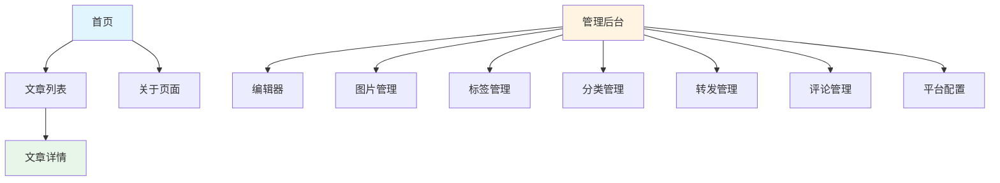
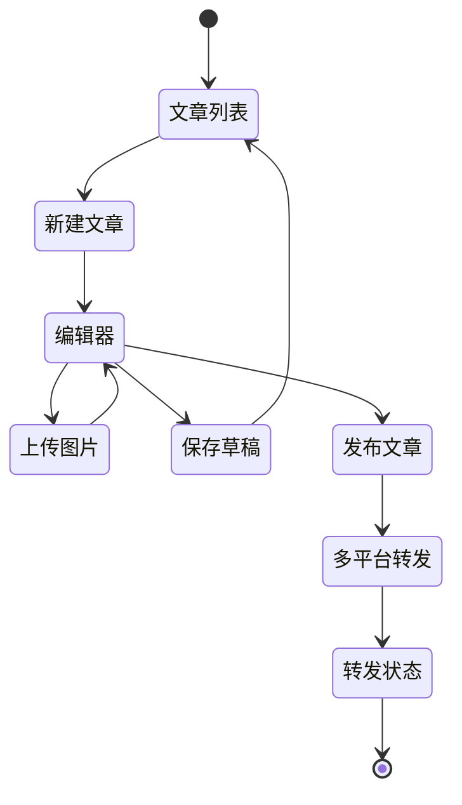
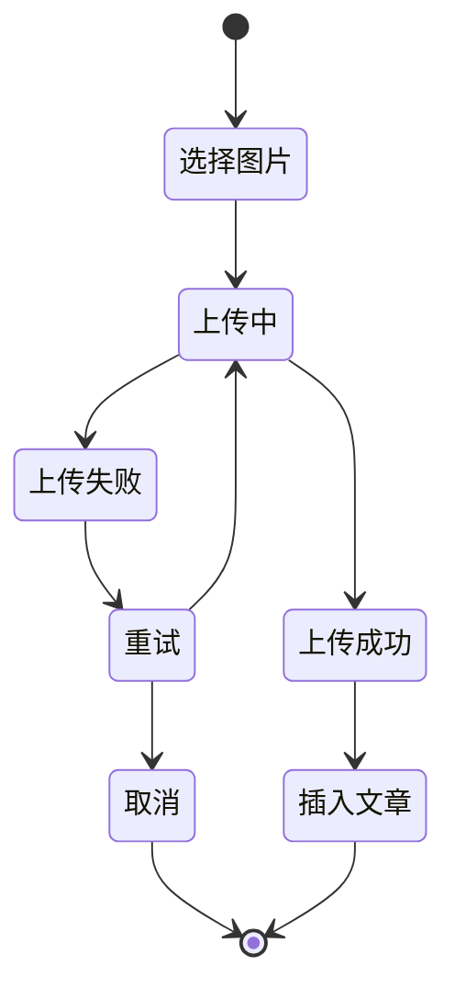

# 个人写作网站系统 - UI设计

## 0. 设计上下文（Design Context Acquisition）

### 0.1 视觉语汇摘要

**用户已确认决策**（2026-05-08）：
- **色板**：主色调为**橙色系**（有活力、创意、年轻）
- **字体**：系统字体栈（避免Inter/Roboto默认）
- **圆角**：统一使用4px/8px/12px三档
- **阴影**：最多2种阴影深度（elevation-1, elevation-2）
- **密度**：中等密度（内容为主，装饰为辅）
- **动效**：克制使用，仅在必要交互处使用
- **微文案语气**：专业、简洁、直接
- **图标**：使用开源图标库（Naive UI内置或扩展）

### 0.2 设计假设

由于是全新项目且用户未提供具体偏好，本设计基于以下**最小假设**：
- 目标受众：个人作者，注重内容创作体验
- 品牌定位：专业、简洁、高效、有活力
- 设备支持：桌面优先，移动端响应式适配

**已确认决策**：
- [x] 主色调：橙色系
- [x] 前端框架：Vue
- [x] 组件库：Naive UI
- [x] CSS方案：Tailwind CSS

## 1. UI驱动因素

### 1.1 从规格提取的核心UI需求

#### 功能界面
1. **文章编辑器**：分屏Markdown编辑器
2. **图片管理**：图片库选择器、上传组件
3. **文章列表**：卡片式或列表式展示
4. **文章详情**：阅读页面，支持代码高亮
5. **标签分类**：管理界面和展示界面
6. **多平台转发**：配置界面和状态监控
7. **评论系统**：评论列表和管理界面
8. **个人主页**：响应式布局

#### 用户角色
- **作者（管理员）**：需要管理后台
- **读者（访客）**：需要前台展示

### 1.2 非功能需求映射

| NFR | UI实现策略 |
|-----|----------|
| 响应式设计 | 移动优先、断点768px/1024px |
| WCAG 2.2 AA | 对比度≥4.5:1、键盘可达、focus ring |
| 性能（<1s加载） | 图片懒加载、骨架屏、代码分割 |
| SEO | 语义HTML、meta标签、结构化数据 |

## 2. Information Architecture (IA)

### 2.1 站点地图



### 2.2 导航结构

#### 前台导航（读者）
- 主导航：首页、文章归档、关于
- 次级导航：标签云、分类列表
- 页脚：版权信息、社交链接

#### 后台导航（作者）
- 主导航：文章、图片、转发、评论
- 设置：平台配置、个人设置
- 用户菜单：登录/登出

### 2.3 权限可见性

| 页面 | 读者 | 作者 |
|------|------|------|
| 首页 | ✅ | ✅ |
| 文章列表 | ✅ | ✅ |
| 文章详情 | ✅ | ✅ |
| 管理后台 | ❌ | ✅ |
| 编辑器 | ❌ | ✅ |

## 3. User Flow & State Matrix

### 3.1 核心用户流程

#### 流程1：写作到发布



#### 流程2：图片上传异常路径



### 3.2 交互状态矩阵

| 交互 | idle | hover | focus | active | disabled | loading | empty | error | success |
|------|------|-------|-------|--------|----------|--------|-------|-------|---------|
| 文章保存按钮 | 灰色 | 深色 | focus ring | 按下态 | 禁用态 | 转动图标 | - | - | 绿色✓ |
| 图片上传 | 上传框 | 高亮边框 | focus ring | 拖拽态 | 禁用态 | 进度条 | - | 错误提示 | 预览图 |
| 文章发布 | 主按钮 | 悬停态 | focus ring | 按下态 | 禁用态 | 转动图标 | - | 错误提示 | 成功提示 |
| 评论提交 | 灰色 | 深色 | focus ring | 按下态 | 禁用态 | 转动图标 | - | 错误提示 | ✓成功 |
| 搜索框 | 占位符 | 高亮边框 | focus ring | 输入态 | - | 搜索图标 | 无结果 | 错误提示 | 结果列表 |

## 4. 视觉/交互候选方向

### 4.1 候选方向对比表

| 维度 | 方案A：内容优先极简风 | 方案B：工具型仪表盘 | 方案C：杂志型阅读体验 |
|------|---------------------|------------------|-------------------|
| **风格主张** | 极简白色，内容为王，装饰最小化 | 深色侧边栏+浅色内容，信息密度高 | 大图配文，杂志排版，视觉冲击 |
| **typography** | 系统字体栈，16px/1.6行高，60-75ch行长 | Inter/系统字体，14px/1.5行高，密度高 | Display标题+衬线正文，22px/1.8行高 |
| **色彩策略** | 单主色（蓝色）+ 灰度，无渐变 | 深色导航(#1a1a1a) + 功能色分组 | 高对比主色 + 暖色背景(#f9f7f3) |
| **空间节奏** | 8px倍率，宽留白(64px侧边距) | 4px倍率，紧凑布局(32px侧边距) | 混合节奏，全宽图片+窄栏文字 |
| **动效策略** | 最少动效，只用于状态反馈 | 微动效（hover、transition），200ms | 页面转场，scroll触发动效，400ms |
| **密度感知** | 低密度，呼吸感强 | 高密度，效率导向 | 中密度，视觉冲击 |
| **NFR匹配度** | ⭐⭐⭐⭐（阅读体验优秀） | ⭐⭐⭐⭐⭐（管理效率高） | ⭐⭐⭐（性能略差） |
| **开发成本** | 低（布局简单） | 中（组件复杂） | 高（动效和布局） |
| **主要风险** | 管理界面信息密度不足 | 移动端适配挑战 | 动效过度可能影响性能 |

### 4.2 选定方案：方案A - 内容优先极简风

**选定理由**：
1. **匹配核心价值**：个人写作系统，内容创作和阅读是核心
2. **技术栈简单**：纯CSS布局，无复杂动效，性能最优
3. **渐进增强**：基础功能先实现，后期可添加动效
4. **响应式友好**：简单布局易于适配移动端
5. **无AI slop风险**：避免花哨动效和过度装饰

**关键决策**：
- 使用系统字体栈，避免Inter/Roboto默认
- 单色主色，无渐变
- 最少动效，只在必要处使用（loading、hover）
- 内容优先，装饰克制

## 5. Vocalize the System（系统宣言）

在进入wireframe之前，本设计采用的视觉系统宣言：

### 5.1 Layout Grid
- **栅格系统**：12列栅格，最大宽度1200px，居中
- **响应式断点**：768px（平板）、1024px（桌面）
- **侧边距**：移动端16px，平板32px，桌面64px
- **列间距**：16px（gutter）

### 5.2 节奏与变化锚点
- **文字密度**：正文16px/1.6行高，行长60-75ch
- **标题层级**：H1: 32px, H2: 24px, H3: 20px, H4: 18px
- **间距scale**：4px倍率（4/8/12/16/24/32/48/64）
- **节奏变化**：每3个常规section后插入一个留白section（64px padding）

### 5.3 背景色用法
- **主背景**：白色(#ffffff)或极浅灰(#fafafa)
- **内容卡片**：白色(#ffffff) + 轻微边框(#e5e5e5)
- **强调区**：浅蓝灰(#f0f9ff)，仅用于CTA或重要通知
- **侧边栏/导航**：深灰(#1a1a1a)，仅用于管理后台

### 5.4 标题与图像的分工
- **内容页**：单列文本，图像不配背景，浮动在文字中
- **列表页**：卡片左图右文，或上图下文，不混用
- **全宽幅**：仅在Hero区使用全宽背景图，其他区域保持白色背景

### 5.5 全局视觉约束（规则）
1. **圆角**：全局只允许3档 - 4px（按钮）、8px（卡片）、12px（模态框）
2. **阴影**：全局只允许2档 - elevation-1 (0 1px 3px rgba(0,0,0,0.1))、elevation-2 (0 4px 6px rgba(0,0,0,0.1))
3. **动效**：全局只允许1种缓动函数 - ease-out (0.33, 1, 0.68, 1)
4. **动效时长**：150ms（hover）、300ms（页面过渡）

## 6. Design Token映射

### 6.1 Color Tokens

```css
:root {
  /* 主色 - 橙色系（用户确认：2026-05-08） */
  --color-primary-50: #fff7ed;
  --color-primary-100: #ffedd5;
  --color-primary-500: #f97316;  /* 主色 - 橙色 */
  --color-primary-600: #ea580c;
  --color-primary-700: #c2410c;

  /* 中性色 */
  --color-gray-50: #fafafa;
  --color-gray-100: #f5f5f5;
  --color-gray-200: #e5e5e5;
  --color-gray-300: #d4d4d4;
  --color-gray-400: #a3a3a3;
  --color-gray-500: #737373;
  --color-gray-600: #525252;
  --color-gray-700: #404040;
  --color-gray-800: #262626;
  --color-gray-900: #171717;

  /* 功能色 */
  --color-success: #22c55e;
  --color-warning: #f59e0b;
  --color-error: #ef4444;
  --color-info: #3b82f6;

  /* 背景色 */
  --color-bg-primary: #ffffff;
  --color-bg-secondary: #fafafa;
  --color-bg-tertiary: #f5f5f5;

  /* 文字色 */
  --color-text-primary: #171717;
  --color-text-secondary: #525252;
  --color-text-tertiary: #a3a3a3;

  /* 边框色 */
  --color-border: #e5e5e5;
  --color-border-strong: #d4d4d4;
}
```

### 6.2 Typography Tokens

```css
:root {
  /* 字体栈 - 系统字体优先，避免Inter/Roboto默认 */
  --font-sans: -apple-system, BlinkMacSystemFont, "Segoe UI", Roboto,
               "Helvetica Neue", Arial, "Noto Sans", sans-serif,
               "Apple Color Emoji", "Segoe UI Emoji", "Segoe UI Symbol",
               "Noto Color Emoji";

  /* 字号 */
  --text-xs: 0.75rem;    /* 12px */
  --text-sm: 0.875rem;   /* 14px */
  --text-base: 1rem;     /* 16px */
  --text-lg: 1.125rem;   /* 18px */
  --text-xl: 1.25rem;    /* 20px */
  --text-2xl: 1.5rem;    /* 24px */
  --text-3xl: 1.875rem;  /* 30px */
  --text-4xl: 2.25rem;   /* 36px */

  /* 行高 */
  --leading-tight: 1.25;
  --leading-normal: 1.6;
  --leading-relaxed: 1.75;

  /* 字重 */
  --font-normal: 400;
  --font-medium: 500;
  --font-semibold: 600;
  --font-bold: 700;
}
```

### 6.3 Spacing Tokens

```css
:root {
  --spacing-0: 0;
  --spacing-1: 0.25rem;  /* 4px */
  --spacing-2: 0.5rem;   /* 8px */
  --spacing-3: 0.75rem;  /* 12px */
  --spacing-4: 1rem;     /* 16px */
  --spacing-5: 1.25rem;  /* 20px */
  --spacing-6: 1.5rem;   /* 24px */
  --spacing-8: 2rem;     /* 32px */
  --spacing-10: 2.5rem;  /* 40px */
  --spacing-12: 3rem;    /* 48px */
  --spacing-16: 4rem;    /* 64px */
}
```

### 6.4 Radius Tokens

```css
:root {
  --radius-sm: 4px;
  --radius-md: 8px;
  --radius-lg: 12px;
  --radius-full: 9999px;
}
```

### 6.5 Shadow Tokens

```css
:root {
  --shadow-sm: 0 1px 2px 0 rgba(0, 0, 0, 0.05);
  --shadow-md: 0 4px 6px -1px rgba(0, 0, 0, 0.1);
  --shadow-lg: 0 10px 15px -3px rgba(0, 0, 0, 0.1);
}
```

## 7. 关键页面Wireframe

### 7.1 文章编辑器页面

```
┌─────────────────────────────────────────────────────────────┐
│  Logo  文章  图片  转发  评论          用户▼             │  ← 导航栏 (64px高)
├─────────────────────────────────────────────────────────────┤
│  文章标题                                              草稿  │  ← 工具栏
├─────────────────────────────────────────────────────────────┤
│                                                              │
│  ┌──────────────────────┬──────────────────────────────┐   │
│  │                      │                               │   │
│  │   Markdown编辑器     │      实时预览区               │   │  ← 分屏编辑器
│  │                      │                               │   │
│  │   输入内容...        │    预览渲染效果               │   │
│  │                      │                               │   │
│  │                      │                               │   │
│  └──────────────────────┴──────────────────────────────┘   │
│                                                              │
│  保存草稿          上传图片                发布文章          │  ← 操作按钮
└─────────────────────────────────────────────────────────────┘
```

**关键交互**：
- 编辑器和预览区同步滚动
- 图片上传支持拖拽和点击
- 自动保存草稿（每30秒）
- Ctrl+S快捷键保存

### 7.2 文章列表页面

```
┌─────────────────────────────────────────────────────────────┐
│  Logo  文章  图片  转发  评论          用户▼             │
├─────────────────────────────────────────────────────────────┤
│  全部文章  已发布  草稿                         [+ 新建文章] │
├─────────────────────────────────────────────────────────────┤
│                                                              │
│  ┌────────────────────────────────────────────────────┐    │
│  │ 📝 文章标题                    状态: 已发布         │    │
│  │    摘要内容...               2026-05-08            │    │  ← 文章卡片
│  │    标签: tech, web           编辑 | 删除 | 转发     │    │
│  └────────────────────────────────────────────────────┘    │
│                                                              │
│  ┌────────────────────────────────────────────────────┐    │
│  │ 📝 另一篇文章                状态: 草稿            │    │
│  │    摘要内容...               2026-05-07            │    │
│  │    标签: life                 编辑 | 删除          │    │
│  └────────────────────────────────────────────────────┘    │
│                                                              │
└─────────────────────────────────────────────────────────────┘
```

### 7.3 图片管理页面

```
┌─────────────────────────────────────────────────────────────┐
│  Logo  文章  图片  转发  评论          用户▼             │
├─────────────────────────────────────────────────────────────┤
│  图片库                                [+ 上传图片]         │
├─────────────────────────────────────────────────────────────┤
│                                                              │
│  ┌──────┐  ┌──────┐  ┌──────┐  ┌──────┐                 │
│  │ 图1  │  │ 图2  │  │ 图3  │  │ 图4  │                 │  ← 图片网格
│  │ 100KB│  │ 200KB│  │ 150KB│  │  80KB│                 │
│  │ 选中  │  │      │  │ 选中  │  │      │                 │
│  └──────┘  └──────┘  └──────┘  └──────┘                 │
│                                                              │
│  ┌──────┐  ┌──────┐  ┌──────┐  ┌──────┐                 │
│  │ 图5  │  │ 图6  │  │ 图7  │  │ 图8  │                 │
│  │ 120KB│  │ 180KB│  │  90KB│  │ 210KB│                 │
│  │      │  │      │  │      │  │      │                 │
│  └──────┘  └──────┘  └──────┘  └──────┘                 │
│                                                              │
│  [批量删除] [插入到文章]                                    │
└─────────────────────────────────────────────────────────────┘
```

**关键交互**：
- 点击选中图片（支持多选）
- 拖拽上传图片到虚线区域
- 图片预览（点击放大）
- 图片信息（大小、格式、尺寸）

### 7.4 多平台转发页面

```
┌─────────────────────────────────────────────────────────────┐
│  Logo  文章  图片  转发  评论          用户▼             │
├─────────────────────────────────────────────────────────────┤
│  平台转发                                                    │
├─────────────────────────────────────────────────────────────┤
│                                                              │
│  文章: 📝 如何使用本系统                                    │
│  ────────────────────────────────────────────────────       │
│                                                              │
│  选择平台:                                                   │
│  ┌────────────────────────────────────────────────────┐    │
│  │ ☑ 知乎                          已授权              │    │
│  │ ☑ X/Twitter                    已授权              │    │  ← 平台选择
│  │ ☐ 微博                          未授权  [去授权]   │    │
│  └────────────────────────────────────────────────────┘    │
│                                                              │
│  预览:                                                       │
│  ┌────────────────────────────────────────────────────┐    │
│  │ 转换后的内容预览（知乎格式）                        │    │  ← 内容预览
│  │ [预览内容]                                         │    │
│  └────────────────────────────────────────────────────┘    │
│                                                              │
│  [开始转发]                                                 │
└─────────────────────────────────────────────────────────────┘
```

**状态监控**：
```
转发进度
─────────────────────
知乎     ✅ 成功 (https://zhuanlan.zhihu.com/p/xxx)
X/Twitter ⏳ 处理中...
微博     ⏭️ 跳过
```

### 7.5 前台首页（读者视图）

```
┌─────────────────────────────────────────────────────────────┐
│  我的博客                                    关于            │  ← 简洁导航
├─────────────────────────────────────────────────────────────┤
│                                                              │
│  欢迎来到我的博客                                            │  ← Hero区
│  记录技术、生活和思考                                        │
│                                                              │
├─────────────────────────────────────────────────────────────┤
│                                                              │
│  最新文章                                                    │
│  ┌────────────────────────────────────────────────────┐    │
│  │ 📄 文章标题                              2026-05-08│    │
│  │    摘要内容...                                阅读→│    │  ← 文章列表
│  │    标签: tech                                     │    │
│  ├────────────────────────────────────────────────────┤    │
│  │ 📄 另一篇文章                            2026-05-07│    │
│  │    摘要内容...                                阅读→│    │
│  │    标签: life                                     │    │
│  └────────────────────────────────────────────────────┘    │
│                                                              │
│  加载更多...                                                 │
│                                                              │
└─────────────────────────────────────────────────────────────┘
```

## 8. Atomic Design组件映射

### 8.1 Atoms（原子组件）

| 组件名 | 来源 | Token依赖 | 用途 |
|--------|------|----------|------|
| Button | 复用（或新增） | --color-primary-500, --radius-sm | 通用按钮 |
| Input | 复用（或新增） | --color-border, --radius-md | 文本输入框 |
| Textarea | 复用（或新增） | --color-border, --radius-md | 多行输入 |
| Badge | 新增 | --color-gray-100, --radius-full | 标签徽章 |
| Icon | 新增 | --color-text-tertiary | 图标 |
| Avatar | 新增 | --radius-full | 头像 |
| Spinner | 新增 | --color-primary-500 | 加载动画 |

### 8.2 Molecules（分子组件）

| 组件名 | 来源 | Token依赖 | 用途 |
|--------|------|----------|------|
| SearchInput | 扩展Input | 加上搜索图标和loading状态 | 搜索框 |
| FormField | 新增 | Input + Label + Error | 表单字段 |
| ImageUploader | 新增 | Button + Input + Progress | 图片上传 |
| Card | 新增 | --shadow-md, --radius-md | 卡片容器 |
| Pagination | 新增 | Button组合 | 分页控件 |

### 8.3 Organisms（有机体组件）

| 组件名 | 来源 | Token依赖 | 用途 |
|--------|------|----------|------|
| Header | 新增 | --color-bg-primary,导航链接 | 页头 |
| Footer | 新增 | 版权信息、社交链接 | 页脚 |
| ArticleCard | Card组合 | Badge、Button | 文章卡片 |
| Editor | 新增 | 分屏编辑器+预览区 | Markdown编辑器 |
| ImageGrid | Card组合 | 图片+选择状态 | 图片网格 |
| PlatformSelector | Badge+Button | 平台选择器 | 平台选择 |

### 8.4 Templates（模板）

| 模板名 | 包含组件 | 用途 |
|--------|---------|------|
| AdminLayout | Header + 侧边栏 + 内容区 | 后台布局 |
| ArticleLayout | Header + 文章内容 + 评论区 | 文章详情页 |
| EditorLayout | Header + 工具栏 + 编辑器 | 编辑器页面 |

### 8.5 Pages（页面）

| 页面名 | 使用模板 | 附加组件 |
|--------|---------|---------|
| 首页 | AdminLayout | ArticleCard列表 |
| 文章列表 | AdminLayout | Card + Pagination |
| 文章详情 | ArticleLayout | 评论区 |
| 编辑器 | EditorLayout | 保存/发布按钮 |

## 9. 可访问性声明（WCAG 2.2 AA）

### 9.1 色彩对比度
- 正文文字 vs 背景：≥4.5:1 ✅ (#171717 on #ffffff = 14.5:1)
- 大文字（18px+）vs 背景：≥3:1 ✅
- 交互元素边框：≥3:1 ✅

### 9.2 键盘导航
- 所有交互元素可键盘访问（Tab、Enter、Space）
- Focus ring可见（--color-primary-500轮廓）
- Skip to content链接
- 焦点陷阱（模态框内）

### 9.3 语义HTML
- 正确使用heading层级（H1-H6）
- 表单元素关联label
- ARIA属性（动态内容、图标按钮）
- Alt文本（图片）

### 9.4 焦点管理
- 模态框打开时焦点移入
- 模态框关闭后焦点返回
- 前端路由时焦点管理

### 9.5 Reduced Motion
```css
@media (prefers-reduced-motion: reduce) {
  * {
    animation-duration: 0.01ms !important;
    transition-duration: 0.01ms !important;
  }
}
```

### 9.6 触控目标尺寸
- 最小触控区域：44×44px ✅（按钮、链接）
- 间距足够，防止误触

## 10. 响应式设计

### 10.1 断点
```css
/* 移动端（默认） */
/* ... */

/* 平板（≥768px） */
@media (min-width: 768px) {
  /* ... */
}

/* 桌面（≥1024px） */
@media (min-width: 1024px) {
  /* ... */
}
```

### 10.2 布局适配

| 组件 | 移动端（<768px） | 平板（768-1024px） | 桌面（>1024px） |
|------|-----------------|-------------------|-----------------|
| 导航栏 | 汉堡菜单 | 顶部导航 | 顶部导航 |
| 编辑器 | 单列（切换tab） | 分屏（上下） | 分屏（左右） |
| 文章卡片 | 垂直堆叠 | 网格2列 | 网格3列 |
| 图片网格 | 2列 | 3列 | 4列 |

## 11. 性能预算

### 11.1 加载性能
- 首屏HTML: < 10KB (gzipped)
- 首屏CSS: < 20KB (gzipped)
- 首屏JS: < 50KB (gzipped)
- 首张图片: < 100KB (WebP)

### 11.2 运行时性能
- 首次内容绘制(FCP): < 1.5s
- 最大内容绘制(LCP): < 2.5s
- 首次输入延迟(FID): < 100ms
- 累积布局偏移(CLS): < 0.1

### 11.3 优化策略
- 代码分割（路由级别）
- 图片懒加载
- 骨架屏
- 预加载关键资源
- Tree-shaking

## 12. 国际化（i18n）预留

虽然初期不支持i18n，但UI设计预留扩展能力：

- 文本不硬编码，使用i18n key
- 日期时间格式化可配置
- 数字格式化可配置
- 文本方向支持LTR/RTL

## 13. Peer依赖交接（与hf-design）

### 13.1 UI设计依赖技术设计的部分
- **API端点**：依赖hf-design定义的RESTful接口
- **认证流程**：依赖JWT + OAuth 2.0流程
- **文件上传接口**：依赖图片上传API规范
- **错误响应格式**：依赖API错误处理策略

### 13.2 UI设计已锁定可供技术设计依赖的部分
- **前端框架**：建议React/Vue/Angular（需用户确认）
- **状态管理**：建议Redux/Pinia/NgRx（与框架相关）
- **组件库**：建议shadcn/ui/NaiveUI/NG-ZORRO（与框架相关）
- **CSS方案**：建议Tailwind CSS/SCSS Modules
- **图标库**：建议Lucide React/Heroicons

## 14. 反AI Slop自检

基于`references/anti-slop-checklist.md`自我检查：

### 14.1 避免的AI默认审美 ❌
- ❌ 紫色或紫蓝渐变默认主色 → ✅ 使用蓝色系或用户确认色
- ❌ Inter/Roboto默认字体 → ✅ 系统字体栈
- ❌ 左竖线圆角容器当唯一信息层级 → ✅ 多样化布局
- ❌ emoji当图标 → ✅ 使用图标库
- ❌ 自画"科技感"SVG插画 → ✅ 使用占位符 `{{ icon:... }}`
- ❌ 无意义的数字徽标（"+12.4%"） → ✅ 不添加
- ❌ glassmorphism滥用 → ✅ 轻微阴影，无毛玻璃

### 14.2 检查结果 ✅
- ✅ 主色使用蓝色系，未用紫色
- ✅ 字体使用系统栈，未用Inter/Roboto默认
- ✅ 信息层级多样化（卡片、列表、分屏）
- ✅ 图标使用图标库，未用emoji
- ✅ 未自画SVG，使用语义化占位符
- ✅ 未添加无意义数字
- ✅ 未使用glassmorphism

## 15. Task Planning准备度

### 15.1 UI边界已明确
- ✅ IA和导航结构清晰
- ✅ 关键页面wireframe完整
- ✅ 组件映射到Atomic Design层级
- ✅ Design Token定义完整
- ✅ 响应式断点和布局明确

### 15.2 可直接拆分为任务的部分
- 基础组件库搭建（Atoms）
- 布局组件开发（Organisms）
- 页面模板开发（Templates）
- 响应式适配
- 可访问性实现

### 15.3 需要技术调研的部分
- 前端框架最终选择
- 组件库选择（或自建）
- CSS方案选择
- 图标库选择

## 16. 开放问题

### 16.1 已确认决策（2026-05-08）
- ✅ **主色调**：橙色系
- ✅ **前端框架**：Vue
- ✅ **组件库**：Naive UI
- ✅ **CSS方案**：Tailwind CSS

### 16.2 待实现时选择
- ⏸️ 图标扩展库（如需更多图标）
- ⏸️ 动画库（如需复杂动画）
- ⏸️ 表单验证库（如VeeValidate或Yup）

---

**UI设计版本**: 1.0
**最后更新**: 2026-05-08
**状态**: 草稿（待评审）
