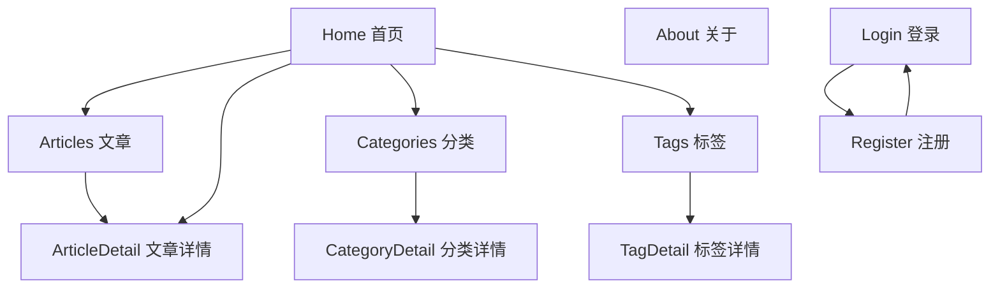
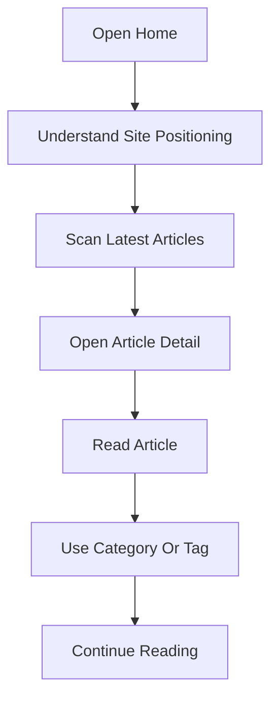
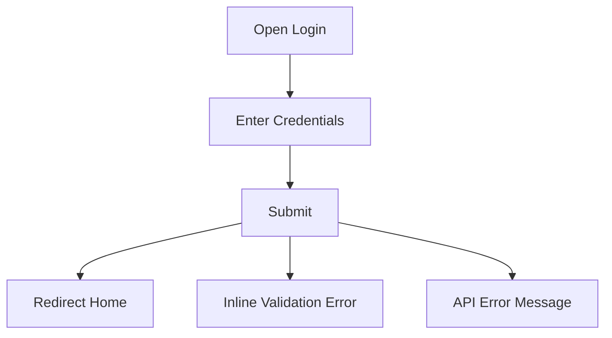

# Blog-Site UI Refactor - UI Design

- 状态: 草稿
- 主题: UI design refactor for the blog-site frontend
- Peer: `features/001-personal-writing-platform/design.md`
- 设计上下文: 已读取当前 Vue/Tailwind/Naive UI 实现、旧 `ui-design.md`、用户反馈和最新 HF UI Implementation Contract 规则

## 0. 视觉语汇摘要

### 0.1 现状冷读

当前 UI 是功能原型级实现：

- 首页使用 `from-blue-600 to-purple-600` 大面积渐变 hero，与旧设计中“橙色主色、无渐变”的约束冲突。
- Header、ArticlePreview、Home 等关键路径大量使用 Tailwind 默认 `gray-*` / `blue-*` utility，缺少设计 token 映射。
- 页面结构是通用 welcome hero + card grid，缺少个人写作网站应有的作者气质、内容节奏和阅读路径。
- 组件风格混杂：公共页面主要是自写 Tailwind，登录/注册依赖 Naive UI，视觉语气不统一。
- 现有测试主要证明元素存在和交互函数可用，不证明视觉设计落地。

### 0.2 新视觉语汇

- **定位**: editorial writing studio，像一个克制的个人写作工作台，而不是 SaaS landing page。
- **情绪**: 安静、可信、温暖、有编辑感。
- **色彩**: warm paper + ink + amber accent。主色延续旧设计已确认的橙色系，但降饱和，避免营销感。
- **字体**: 系统字体栈，明确理由是中文显示稳定、加载快、跨平台一致；通过字号、字重、行长和留白建立质感。
- **圆角**: 4px / 8px / 12px 三档。
- **阴影**: 最多两档，优先使用 border 和背景层级，少用浮起卡片。
- **密度**: 阅读页低密度，列表页中密度，管理/表单页中高密度。
- **动效**: 只用于 hover/focus/loading，150ms/240ms 两档，尊重 reduced motion。
- **禁用模式**: 不使用蓝紫渐变 hero，不使用通用 SaaS dashboard KPI，不使用 emoji 作为图标，不自造装饰 SVG，不使用 5+ 阴影层级。

## 1. 概述与范围

本 feature 只解决 UI 设计和后续 UI refactor 的设计合同，不新增业务功能。

### 1.1 第一波实现范围

- App shell: Header / Footer / route surfaces
- Public reading: Home / ArticleList / ArticlePreview / ArticleDetail
- Discovery: CategoryArchive / CategoryDetail / TagCloud / TagDetail
- Auth: Login / Register
- Shared visual system: tokens, surfaces, typography, state patterns

### 1.2 延后范围

- Admin article management visual redesign
- Markdown editor redesign
- Publication workflow redesign
- Comment management redesign

这些页面后续应复用本设计 token，但不在第一波定义完整 wireframe。

## 2. UI 驱动因素

### 2.1 规格映射

| Source | UI requirement | Design implication |
|---|---|---|
| `spec.md` 3.1 网站展示 | 首页文章列表、文章详情、关于页面、响应式、SEO | 公共阅读路径必须清晰，首屏建立作者/内容定位 |
| `spec.md` 3.2 主题定制 | 自定义配色、个人信息配置 | 需要 token 化主色和可扩展主题边界 |
| `spec.md` NFR 性能 | 列表 < 1s，详情 < 1.5s | 避免重图片/复杂动效；优先 CSS 和系统字体 |
| `spec.md` NFR 可访问性隐含 | 响应式、可用性 | focus、对比度、键盘和状态必须设计 |
| 用户反馈 | 当前 UI “毫无设计” | 不接受默认模板，必须有视觉主张和实现合同 |

### 2.2 设计目标

- 让公共页面看起来像“个人写作网站”，不是 Vite/Tailwind 模板。
- 让所有视觉选择可追溯到 token 和页面级 visual invariants。
- 让后续任务能通过 screenshot / DOM / console / network evidence 验证设计落地。

## 3. 信息架构



### 3.1 导航结构

- Primary nav: 首页 / 文章 / 分类 / 关于
- Secondary discovery: 标签云作为文章发现入口，不放入首屏主导航。
- Auth links: 登录 / 注册放在右侧轻量入口，不与内容导航竞争。

## 4. 关键用户流

### 4.1 读者浏览文章



异常路径：

- API 失败：展示不崩溃的空态/错误态，允许重试或继续浏览静态 fallback。
- 无文章：显示编辑感空态文案，而不是大图标模板。

### 4.2 作者登录



## 5. 候选视觉 / 交互方向与对比

| 方向 | 风格主张 | Typography | 色彩策略 | 空间/密度 | 动效策略 | NFR / 约束匹配 | 主要风险 | 可逆性 |
|---|---|---|---|---|---|---|---|---|
| A. Editorial Studio | 纸面、墨色、暖橙强调，突出写作和阅读 | 系统中文字体，文章页 18/1.8，列表 16/1.6 | warm paper + ink + amber | 低到中密度，强留白和清晰行长 | 150ms hover/focus | 性能好、a11y 可控、符合个人写作 | 需要克制，避免过淡 | 高 |
| B. Creator Dashboard | 作者工作台感，信息密度更高 | 14-16px，紧凑组件 | neutral + amber status | 中高密度 | 150/240ms | 管理效率高 | 前台读者体验像后台 | 中 |
| C. Magazine Lead | 杂志感大标题和强视觉分区 | display-like 大标题，正文更宽松 | warm neutral + image-led | 低密度，大封面节奏 | 240ms | 视觉记忆点强 | 缺真实封面图时容易伪装 | 中 |

## 6. 选定方向与关键 UI 决策

选定：**A. Editorial Studio**。

理由：

- 与个人写作网站的核心价值最匹配。
- 不依赖真实图片或插画，不会被迫生成 AI 装饰图。
- 可以用 token、排版和内容节奏建立质量感，性能风险低。
- 能逐步扩展到后台/编辑器，而不会强迫所有页面变成 dashboard。

关键决策：

- 主色为 warm amber，不使用现有蓝紫渐变。
- 用 border / background / typography 建立层级，阴影只用于可交互卡片 hover。
- 首页首屏从“欢迎语”改为“作者定位 + 阅读路径 + 最近内容”。
- ArticlePreview 从普通白卡升级为 editorial list/card hybrid，强调标题、摘要和阅读元信息。

### 6.1 UI Decision ADR 摘要

| Decision | Choice | Why | Alternatives Rejected | Reversibility |
|---|---|---|---|---|
| Visual direction | Editorial Studio | 最贴合个人写作和阅读，不依赖伪造图片 | Creator Dashboard 太像后台；Magazine Lead 缺真实图片时易变成装饰 | High |
| Brand color | Warm amber / paper / ink | 继承旧设计橙色确认，并降低营销感 | 现有 blue/purple gradient 与设计目标冲突 | High |
| Typography | System font + strict rhythm | 中文稳定、性能好、无需字体资产 | Custom webfont 增加加载和字形风险 | High |
| Surface strategy | Border-first, low shadow | 更像纸面编辑系统，避免浮卡模板 | shadow-heavy cards 和 glassmorphism | Medium |
| Imagery | No invented decorative images | 缺真实资产时避免 AI slop | 自画 SVG / stock-style hero | High |

### 6.2 沿用与有意识偏离

| Source | 沿用 | 偏离 |
|---|---|---|
| 旧 UI 设计 | Vue + Naive UI + Tailwind；橙色主色；三档圆角；两档阴影 | 放弃蓝色候选、浅蓝灰强调区和泛化“极简白色” |
| 当前实现 | 现有 public routes、文章数据结构、ArticlePreview 可点击卡片 | 移除蓝紫渐变、蓝色 active nav、默认灰卡片和 shadow-heavy 风格 |
| 产品规格 | 首页、文章、分类、标签、关于、认证等 public surface | 不新增 testimonial / feature grid / KPI section |

## 6.5 系统宣言

### Layout Grid

- 页面最大宽度：`--layout-page-max: 1120px`
- 阅读正文宽度：`--layout-reading-max: 720px`
- 首页/列表左右 padding：mobile 20px，tablet 32px，desktop 48px
- 断点：640px / 768px / 1024px

### 节奏与变化锚点

- 首页 section 间距：64px desktop / 40px mobile
- 文章卡片之间：24px
- 阅读正文：18px / 1.8，60-72ch
- 标题层级：
  - display: 48/1.05 desktop, 34/1.1 mobile
  - h1: 40/1.15
  - h2: 28/1.25
  - body: 16/1.65

### 背景色用法

- 全局背景：paper (`#fbf7ef`)
- 内容 surface：paper elevated (`#fffaf2`)
- 重点 surface：amber wash (`#fff1dc`)
- 不再用蓝紫渐变或大面积高饱和背景。

### 标题与图像分工

- 没有真实封面图时，不制造装饰图。
- 文章列表不强制封面，靠排版、标签和摘要建立内容吸引力。
- 图片仅在文章有真实 `coverImage` 时显示。

### 全局视觉约束

- Radius: 4 / 8 / 12
- Shadow: elevation-1 / elevation-2，默认不用 shadow
- Motion: 150ms hover/focus, 240ms route/state transition
- Focus ring: amber 600 + 2px offset

## 7. 视觉系统

### 7.1 Typography

| Token | Value | Usage |
|---|---|---|
| `font.family.sans` | system UI stack | UI and Chinese content |
| `font.size.body` | 16px | normal UI text |
| `font.size.reading` | 18px | article body |
| `font.size.display` | 48px desktop / 34px mobile | Home hero |
| `lineHeight.body` | 1.65 | UI body |
| `lineHeight.reading` | 1.8 | article content |

### 7.2 Color

| Token | Light | Usage |
|---|---|---|
| `color.bg.page` | `#fbf7ef` | global page background |
| `color.bg.surface` | `#fffaf2` | cards/forms/article surfaces |
| `color.bg.accentSubtle` | `#fff1dc` | subtle highlight blocks |
| `color.fg.default` | `#241c15` | primary text |
| `color.fg.muted` | `#6f6257` | meta text |
| `color.fg.subtle` | `#9a8a7c` | less important text |
| `color.primary` | `#c45f12` | non-text accent, border, icon, large display accent |
| `color.primaryBg` | `#9f4f10` | filled primary button background |
| `color.onPrimary` | `#ffffff` | text/icon on filled primary controls |
| `color.primaryText` | `#9f4f10` | text links on paper backgrounds |
| `color.primaryHover` | `#9f4f10` | hover |
| `color.border.default` | `#eadfce` | surface border |
| `color.border.strong` | `#d6c6b1` | focused or active border |
| `color.danger` | `#b42318` | errors |
| `color.success` | `#287a3e` | success |
| `color.info` | `#3f6f8f` | informational, not brand |

#### Contrast Evidence

| Pair | Ratio | Usage | Verdict |
|---|---:|---|---|
| `color.fg.default` on `color.bg.page` | 15.70:1 | primary text | AA/AAA pass |
| `color.fg.muted` on `color.bg.page` | 5.52:1 | meta text | AA pass |
| `color.fg.subtle` on `color.bg.page` | 3.12:1 | large labels / non-critical UI only | AA large / UI pass; not body text |
| `color.primary` on `color.bg.page` | 3.94:1 | filled buttons, icons, large display accents | UI component pass; not normal text |
| `color.primaryText` on `color.bg.page` | 5.46:1 | text links and active nav | AA pass |
| `color.onPrimary` on `color.primaryBg` | 5.83:1 | primary filled button label/icon | AA pass |
| `color.onPrimary` on `color.primary` | 4.21:1 | not allowed for normal text | fails normal AA; do not use for filled text |
| `color.danger` on `color.bg.surface` | 6.33:1 | error text | AA pass |
| `color.success` on `color.bg.surface` | 5.12:1 | success text | AA pass |
| `color.info` on `color.bg.surface` | 5.21:1 | info text | AA pass |
| `color.fg.default` on `color.bg.accentSubtle` | 15.07:1 | highlight body text | AA/AAA pass |
| `color.primary` on `color.bg.accentSubtle` | 3.78:1 | filled controls / large accents only | UI component pass; not normal text |

Rules:

- Normal-size text links must use `color.primaryText`, not `color.primary`.
- Filled primary buttons must use `color.primaryBg` + `color.onPrimary`; `color.primary` is reserved for non-text accents, borders, icons, and large display accents.
- Hover for filled primary buttons uses `color.primaryHover` + `color.onPrimary`; this remains 5.83:1 or stronger when using the same dark amber background family.

### 7.3 Spacing / Layout

| Token | Value |
|---|---|
| `space.1` | 4px |
| `space.2` | 8px |
| `space.3` | 12px |
| `space.4` | 16px |
| `space.6` | 24px |
| `space.8` | 32px |
| `space.12` | 48px |
| `space.16` | 64px |

### 7.4 Radius / Elevation

| Token | Value | Usage |
|---|---|---|
| `radius.sm` | 4px | badges, small controls |
| `radius.md` | 8px | buttons, inputs |
| `radius.lg` | 12px | cards, forms |
| `shadow.elevation1` | `0 1px 2px rgba(36, 28, 21, .08)` | elevated hover only |
| `shadow.elevation2` | `0 12px 32px rgba(36, 28, 21, .12)` | modal/popover |

### 7.5 Motion

- `motion.fast`: 150ms ease-out
- `motion.normal`: 240ms ease-out
- reduced motion: remove transforms, keep color/border transitions.

## 8. 关键页面 Wireframe

### 8.1 Home

```text
+--------------------------------------------------------------+
| Header: My Blog                         Articles Categories  |
+--------------------------------------------------------------+
| Editorial hero                                                |
| "写作、工程与长期思考"                                       |
| Short positioning sentence                                    |
| [Start reading] [About the author]                            |
| Small metadata line: latest topics / update rhythm             |
+--------------------------------------------------------------+
| Latest essays                                                 |
|  [ArticlePreview editorial card]                              |
|  [ArticlePreview editorial card]                              |
|  [ArticlePreview editorial card]                              |
+--------------------------------------------------------------+
| Explore by category / tag                                     |
+--------------------------------------------------------------+
```

### 8.2 Article List

```text
Page title + intro
Filter/discovery row (category/tag future compatible)
Article list in 1 column desktop reading-friendly layout
Each item: title, excerpt, date/category/tags, subtle read affordance
```

### 8.3 Article Detail

```text
Header
Article masthead: category, title, excerpt, date/tags
Reading progress
Article body constrained to 720px
Related / back to articles
```

### 8.4 Auth Pages

```text
Centered form card on paper background
Small product heading, no generic gradient
Inline validation, visible focus, server error alert
Secondary link to login/register
```

## 9. Atomic 组件映射

| Layer | Component | Source | Token dependencies | Notes |
|---|---|---|---|---|
| Atom | Button | app token wrapper over native / Naive button | color.primaryBg, color.onPrimary, color.primaryText, radius.md, motion.fast | primary/secondary/text variants |
| Atom | Badge | new lightweight component | color.bg.accentSubtle, radius.sm | tags/categories |
| Atom | FocusRing | global CSS | color.primary | use `:focus-visible` |
| Molecule | NavLink | existing router-link pattern | color.fg.muted, color.primaryText | active state required |
| Molecule | ArticleMeta | new shared pattern | color.fg.muted, space.2 | date/category/tags |
| Organism | SiteHeader | refactor `Header.vue` | bg.surface, border.default | sticky but lighter |
| Organism | ArticlePreview | refactor existing | typography, border.default, motion.fast | editorial card/list hybrid |
| Organism | AuthFormSurface | Login/Register shared pattern | bg.surface, border.default, radius.lg | keeps Naive UI but token-aligned |
| Template | PublicPage | new CSS/layout pattern | layout.page, bg.page | Home/List/Category/Tag |
| Template | ReadingPage | existing ArticleDetail adapted | layout.reading | article body |

## 10. 交互状态矩阵

| Interaction | idle | hover | focus | active | disabled | loading | empty | error | success |
|---|---|---|---|---|---|---|---|---|---|
| Primary CTA | `primaryBg` + `onPrimary` | darker amber | 2px amber ring | slight press | muted bg | spinner/text | N/A | N/A | N/A |
| Nav link | muted ink | primaryText | underline + ring | primaryText | N/A | N/A | N/A | N/A | active primaryText |
| Mobile menu | closed button | amber icon/text | focus ring | menu open | N/A | N/A | N/A | N/A | closes after nav |
| Article card | surface border | border strong + elevation1 | card ring | N/A | N/A | skeleton slot | N/A | N/A | N/A |
| Article list load | N/A | N/A | N/A | N/A | N/A | skeleton rows | editorial empty message | retry panel | cards rendered |
| Article detail | article loaded | link hover | heading/anchor focus | N/A | N/A | article skeleton | "文章不存在" panel | retry/back panel | article rendered |
| Category/Tag discovery | list/grid | item hover | item focus | selected item | N/A | skeleton chips/cards | empty topic message | retry panel | filtered results |
| Auth form fields | pristine | border strong | focus ring | input active | disabled during submit | N/A | N/A | inline field error | valid state |
| Auth submit | `primaryBg` + `onPrimary` | darker amber | ring | press | disabled | spinner | N/A | inline/server alert | redirect + message |
| Network degraded state | content visible | retry hover | retry focus | retry active | retry disabled | retrying | cached/fallback copy | error + next step | fresh content |

## 11. UI Implementation Contract

### 11.1 App Shell / Header

- Scope: `Header.vue`, public page header
- Route / Entry Point: all public routes
- Primary user task: move between reading surfaces without visual noise
- Source anchors:
  - Spec: `001 spec.md` 3.1 website display
  - UI design: section 6.5, 7, 8.1
  - hf-design dependency: router paths remain unchanged

#### Visual Invariants

| Invariant | Required Value / Pattern | Source Token / Decision | Must Not Do |
|---|---|---|---|
| Header surface | paper/surface background with bottom border | `color.bg.surface`, `color.border.default` | no shadow-heavy sticky bar |
| Active nav | amber text or underline | `color.primaryText` | no `blue-600` active state |
| Logo | text mark, ink color | `color.fg.default` | no gradient logo |
| Motion | color/border only | `motion.fast` | no scale bounce |

#### Token Consumption

| UI element | Required token(s) | Allowed local utility mapping | Forbidden hardcoded styles |
|---|---|---|---|
| nav link | `color.fg.muted`, `color.primaryText` | `text-[var(--color-fg-muted)]`, `text-[var(--color-primary-text)]` | `hover:text-blue-600` |
| header border | `color.border.default` | `border-[var(--color-border-default)]` | raw gray border without mapping |

#### Evidence Targets

- Browser routes / stories to capture: `/`, `/articles`, `/login`
- Required viewports: 1366x768, 390x844
- Required screenshot artifacts: `header-desktop.png`, `header-mobile.png`
- DOM anchors / selectors: `header`, `nav`, `a[href="/articles"]`
- Console / network assertions: no router warnings, no console errors
- Allowed visual deviations: none for blue active nav
- Deviation handling: update this UI design first; do not drift in code.

### 11.2 Home Hero

#### Visual Invariants

| Invariant | Required Value / Pattern | Source Token / Decision | Must Not Do |
|---|---|---|---|
| Background | paper background with optional amber wash block | `color.bg.page`, `color.bg.accentSubtle` | no blue/purple gradient |
| Title | editorial display title, ink color | `font.size.display`, `color.fg.default` | no generic "欢迎来到我的博客" as only positioning |
| CTA | amber filled primary + secondary text link | `color.primaryBg`, `color.onPrimary`, `color.primaryText` | no white button on saturated gradient |
| Content strategy | explain author/content value and lead to articles | section 6 | no filler hero copy |

#### Token Consumption

| UI element | Required token(s) | Allowed local utility mapping | Forbidden hardcoded styles |
|---|---|---|---|
| hero section | `color.bg.page`, `space.16` | CSS vars in Tailwind arbitrary values | `from-blue-600`, `to-purple-600` |
| primary CTA | `color.primaryBg`, `color.onPrimary`, `radius.md` | app button class | `text-blue-600`, white button on gradient |

#### Evidence Targets

- Browser routes / stories to capture: `/`
- Required viewports: 1366x768, 390x844
- Required screenshot artifacts: `home-hero-desktop.png`, `home-hero-mobile.png`
- DOM anchors / selectors: `main`, `h1`, `a[href="/articles"]`
- Console / network assertions: article list request is `/api/v1/articles...`, no 5xx
- Allowed visual deviations: copy can change if it preserves editorial positioning

### 11.3 ArticlePreview / Article List

#### Visual Invariants

| Invariant | Required Value / Pattern | Source Token / Decision | Must Not Do |
|---|---|---|---|
| Card surface | bordered editorial surface, low elevation | `color.bg.surface`, `color.border.default` | default floating white card grid only |
| Title | ink, strong, hover amber | `color.fg.default`, `color.primaryText` | `hover:text-blue-600` |
| Meta | subdued, readable | `color.fg.muted` | overly small low-contrast gray |
| Tags | amber wash badges | `color.bg.accentSubtle`, `radius.sm` | default gray pills without mapping |

#### Evidence Targets

- Browser routes / stories to capture: `/`, `/articles`, `/categories/:id`, `/tags/:name`
- Required viewports: 1366x768, 390x844
- Required screenshot artifacts: `article-list-desktop.png`, `article-list-mobile.png`
- DOM anchors / selectors: article card root, article title, tag badge
- Console / network assertions: no `article.content` runtime error; no unexpected API host

### 11.4 Article Detail

#### Visual Invariants

| Invariant | Required Value / Pattern | Source Token / Decision | Must Not Do |
|---|---|---|---|
| Reading width | max 720px body | `layout.reading` | full-width hard-to-read body |
| Body rhythm | 18px / 1.8 | `font.size.reading`, `lineHeight.reading` | dense default 16px article body |
| Headings | strong hierarchy with spacing | typography tokens | random heading margins |
| Code blocks | readable contrast, no heavy decoration | semantic surface tokens | unreadable low contrast |

#### Evidence Targets

- Browser routes / stories to capture: `/articles/1`
- Required viewports: 1366x768, 390x844
- Required screenshot artifacts: `article-detail-desktop.png`, `article-detail-mobile.png`
- DOM anchors / selectors: `article`, `h1`, rendered markdown body
- Console / network assertions: article detail request uses `/api/v1/articles/:id`

### 11.5 Auth Forms

#### Visual Invariants

| Invariant | Required Value / Pattern | Source Token / Decision | Must Not Do |
|---|---|---|---|
| Form surface | centered paper card | `color.bg.surface`, `radius.lg` | blue/purple marketing background |
| Error state | inline text + semantic color + aria | `color.danger` | color-only error |
| Focus | visible amber ring | `color.primary` | invisible focus |
| Provider | app root includes Naive UI providers | implementation dependency | mocked provider only |

#### Token Consumption

| UI element | Required token(s) | Allowed local utility mapping | Forbidden hardcoded styles |
|---|---|---|---|
| submit button | `color.primaryBg`, `color.onPrimary`, `radius.md` | app button / Naive UI theme override | `bg-blue-*`, `text-blue-*`, `color.primary` as button text background without `onPrimary` contrast |
| field label | `color.fg.default` | CSS vars / Naive theme token | low contrast gray |
| error text | `color.danger` | CSS vars / Naive theme token | color-only error without message |

#### Evidence Targets

- Browser routes / stories to capture: `/login`, `/register`
- Required viewports: 1366x768, 390x844
- Required screenshot artifacts: `login-desktop.png`, `register-mobile.png`
- DOM anchors / selectors: form, email input, password input, submit button
- Console / network assertions: no `useMessage` provider error, auth requests use `/api/v1/auth/*`

### 11.6 Discovery Surfaces: Category / Tag

- Scope: `CategoryArchive.vue`, `CategoryDetail.vue`, `TagCloud.vue`, `TagDetail.vue`
- Route / Entry Point: `/categories`, `/categories/:id`, `/tags/:name`
- Primary user task: browse the archive by topic without leaving the editorial visual system

#### Visual Invariants

| Invariant | Required Value / Pattern | Source Token / Decision | Must Not Do |
|---|---|---|---|
| Discovery heading | ink heading + short intro | typography tokens | generic page title only |
| Topic chips/cards | amber wash or bordered surface | `color.bg.accentSubtle`, `color.border.default` | default gray pills without token mapping |
| Result list | same ArticlePreview contract | section 11.3 | separate visual language for filtered pages |
| Empty state | editorial copy + back/browse action | section 11.8 | blank page or icon-only empty state |

#### Evidence Targets

- Browser routes / stories to capture: `/categories`, first available `/categories/:id`, first available `/tags/:name`
- Required viewports: 1366x768, 390x844
- Required screenshot artifacts: `categories-desktop.png`, `category-detail-mobile.png`, `tag-detail-mobile.png`
- DOM anchors / selectors: page heading, topic link/chip, article card root or empty state panel
- Console / network assertions: category/tag requests use `/api/v1/categories*` or `/api/v1/tags*`; no unexpected host

### 11.7 About / Footer

- Scope: `About.vue`, `Footer.vue`
- Route / Entry Point: `/about`, all public pages footer
- Primary user task: understand the author/site and finish reading with low-friction navigation

#### Visual Invariants

| Invariant | Required Value / Pattern | Source Token / Decision | Must Not Do |
|---|---|---|---|
| About surface | editorial text blocks, no marketing feature grid | `color.bg.page`, typography tokens | SaaS feature cards/testimonials |
| Author positioning | specific writing/engineering voice | microcopy section | generic "about me" filler |
| Footer | quiet ink/muted links on paper | `color.fg.muted`, `color.border.default` | heavy dark footer unless redesign approved |
| Links | accessible text links | `color.primaryText` | `blue-600` link color |

#### Evidence Targets

- Browser routes / stories to capture: `/about`, `/`
- Required viewports: 1366x768, 390x844
- Required screenshot artifacts: `about-desktop.png`, `footer-mobile.png`
- DOM anchors / selectors: `main h1`, footer root, footer links
- Console / network assertions: no console errors

### 11.8 Shared Empty / Error / Loading Panels

- Scope: public list/detail/auth data states
- Route / Entry Point: any public route with remote data
- Primary user task: recover from missing or failed content without a blank or broken page

#### Visual Invariants

| Invariant | Required Value / Pattern | Source Token / Decision | Must Not Do |
|---|---|---|---|
| Loading | skeleton or restrained text, layout-preserving | `color.bg.surface`, `motion.fast` | spinner-only layout jump for major content |
| Empty | editorial copy + next action | microcopy section | icon-only template empty state |
| Error | clear cause + retry/back action | `color.danger`, `color.bg.surface` | console-only error or silent failure |
| Offline/partial | preserve available content and mark staleness | `color.info`, `color.fg.muted` | discard visible content unnecessarily |

#### Evidence Targets

- Browser routes / stories to capture: `/articles` with empty/mock state if feasible; `/articles/:missing` for detail error if route exists
- Required viewports: 1366x768, 390x844
- Required screenshot artifacts: `empty-state.png`, `error-state.png`
- DOM anchors / selectors: `[data-ui-state="empty"]`, `[data-ui-state="error"]`, retry/back action
- Console / network assertions: expected handled API failure only; no uncaught page error

### 11.9 Mobile Navigation

- Scope: `Header.vue` mobile menu
- Route / Entry Point: all public routes at 390x844
- Primary user task: reach primary content surfaces with keyboard/touch accessible controls

#### Visual Invariants

| Invariant | Required Value / Pattern | Source Token / Decision | Must Not Do |
|---|---|---|---|
| Toggle | 44px touch target, visible label/aria | a11y section | icon button without accessible name |
| Menu surface | paper surface, border divider | `color.bg.surface`, `color.border.default` | floating dark dropdown unrelated to header |
| Active state | amber active text/underline | `color.primaryText` | blue active state |
| Focus | visible ring on toggle and links | `color.primaryText` | invisible focus |

#### Evidence Targets

- Browser routes / stories to capture: `/` mobile with menu closed and open
- Required viewports: 390x844
- Required screenshot artifacts: `mobile-nav-closed.png`, `mobile-nav-open.png`
- DOM anchors / selectors: menu toggle button, nav menu, primary links
- Console / network assertions: no router warnings

## 12. 可访问性

### 12.1 Contrast And Color Use

- Body text: `color.fg.default` on `color.bg.page` = 15.70:1.
- Muted text: `color.fg.muted` on `color.bg.page` = 5.52:1.
- Text links / active nav: `color.primaryText` on `color.bg.page` = 5.46:1.
- Error text: `color.danger` on `color.bg.surface` = 6.33:1.
- `color.primary` is not allowed for normal-size text on paper; use `color.primaryText`.

### 12.2 Semantics And Keyboard

- Header includes a skip link target to `main` in implementation tasks.
- Mobile menu toggle uses `button`, `aria-expanded`, `aria-controls`, and visible `aria-label`.
- Article card click behavior must be implemented as an actual link or include keyboard activation (`Enter`/`Space`) with role and focus ring; preferred implementation is link-wrapped card content.
- Auth inputs must have labels and `autocomplete="email"`, `autocomplete="current-password"`, or `autocomplete="new-password"` as appropriate.
- Route page structure uses one `h1` per page and ordered headings.

### 12.3 Focus, Errors, Motion

- All links, buttons, inputs use visible `:focus-visible` ring with 2px offset.
- Form field errors use inline text + semantic color + `aria-describedby`; server errors use `role="alert"` or `aria-live="polite"`.
- Empty/error panels include actionable text; no color-only signaling.
- Motion removes transforms under `prefers-reduced-motion: reduce`; color/border transitions may remain.
- Touch target: primary nav, menu toggle, CTAs, and form submit are >= 44px; compact inline links remain >= 24px and have enough spacing.

## 13. 响应式与多端

| Surface | Mobile | Tablet | Desktop |
|---|---|---|---|
| Header | compact nav menu, same tokens | horizontal nav if width allows | full horizontal nav |
| Home hero | single column, 34px display | single column with wider measure | two rhythm zones, no forced image |
| Article list | one column | one column | one column or 2-column only if content density remains readable |
| Article detail | 20px page padding | reading max width | reading max 720px centered |
| Auth forms | full-width card with 20px margin | max 420px | max 420px |

## 14. i18n / 国际化

Not in first implementation wave. Token choices must not assume Latin-only typography; Chinese text must remain first-class.

## 15. 前端性能预算

- No custom webfont in first wave.
- No decorative hero image.
- No heavy animation library.
- First implementation should keep current route-level code splitting.
- Screenshot smoke should verify no blank app root and no console errors.
- Task evidence must carry the original performance claims forward: article list visible content < 1s target, article detail visible content < 1.5s target.
- Browser evidence should record no blank-root regression and no obvious CLS from loading → loaded state on Home, ArticleList, and ArticleDetail.
- If exact performance timing is not automated in first wave, regression records must state this as an uncovered area and keep the layout-preserving skeleton/empty/error checks.

## 16. Microcopy 与语气

- Home hero copy should be specific to writing/engineering reflection.
- Empty states should explain what is missing and provide a next action.
- Avoid generic SaaS phrases such as "unlock productivity" or "seamless experience".
- Missing final copy uses semantic placeholders, for example `{{ copy:home-positioning }}`.

## 17. 与 hf-design 的 peer 依赖交接

### 17.1 本文档依赖 hf-design 锁定的条目

- Public route paths remain as currently implemented.
- API base remains proxied through `/api`.
- Auth store continues using `/api/v1/auth/*`.
- Article DTO may provide `content`, `excerpt`, `publishedAt`, `createdAt`, `categoryName`, `tags`.

### 17.2 本文档已锁定、可供 hf-design 依赖的条目

- UI does not require backend schema changes.
- UI does not require new image/asset service.
- Public route screenshot smoke should include `/`, `/articles`, `/categories`, `/login`, `/register`, and one detail route where data exists.

### 17.3 冲突或待协商

- None blocking. Admin/editor visual redesign intentionally deferred.

## 18. 任务规划准备度

Ready for `hf-ui-review`.

After approval, `hf-tasks` should split implementation into at least:

1. Design token foundation and global CSS.
2. App shell/header/footer refactor.
3. Home hero and public page layout refactor.
4. ArticlePreview/List/Discovery refactor.
5. ArticleDetail reading surface refactor.
6. Auth page visual alignment.
7. Browser screenshot smoke and UI conformance evidence.

Each task must include UI contract anchors and screenshot/DOM evidence targets.

## 19. 明确排除与延后项

- No backend feature work.
- No new content platform UI.
- No redesign of Markdown editor in first wave.
- No custom font dependency.
- No dark mode in first wave.

## 20. 风险与开放问题

| Risk | Severity | Handling |
|---|---|---|
| Warm editorial system may feel too quiet | medium | Review screenshots before implementation completion |
| Existing tests assert old class behavior | medium | Update tests to assert behavior and contract anchors, not old colors |
| Tailwind v4 token mapping may need CSS var strategy | medium | First implementation task should establish token utilities |
| Lack of real article covers | low | Do not invent imagery; use typography-led design |

## 21. 反 AI slop 自检记录

1. 文案可回指规格和用户反馈：是。首页定位需在实现前确认最终 copy。
2. 每个 token 有出处：是。主色继承旧设计橙色确认，并降饱和为 amber。
3. 图标/插画是否自证存在价值：不新增装饰插画；无 emoji 图标。
4. 每个 section 是否有规格依据：是。Home / list / detail / auth 都来自现有 public surfaces。
5. 整页是否像通用 SaaS dashboard：否。明确禁止 KPI grid、蓝紫渐变、默认 dashboard 模板。
